# DIAGRAMS — VIETNAM LAW CHATBOT

> Tệp chứa toàn bộ sơ đồ Mermaid phục vụ báo cáo đồ án.
>
> **Cách xuất ảnh:**
> - VS Code: cài extension **"Markdown Preview Mermaid Support"** → `Ctrl+Shift+V` → screenshot hoặc right-click → Save Image.
> - Online: copy từng block vào **https://mermaid.live** → Export PNG.
> - **Sơ đồ Use Case**: xem ghi chú tại mỗi hình — khuyến nghị vẽ thêm trong draw.io để có hình actor chuẩn UML.
>
> **Quy chuẩn caption Word:** `Hình X.Y. Mô tả ngắn gọn.` — đặt bên dưới hình, căn giữa, in nghiêng.

---

## I. CHƯƠNG 2 — SƠ ĐỒ KIẾN TRÚC & PHƯƠNG PHÁP

---

### Hình 2.1. Kiến trúc tổng quan hệ thống Vietnam Law Chatbot (Microservices)

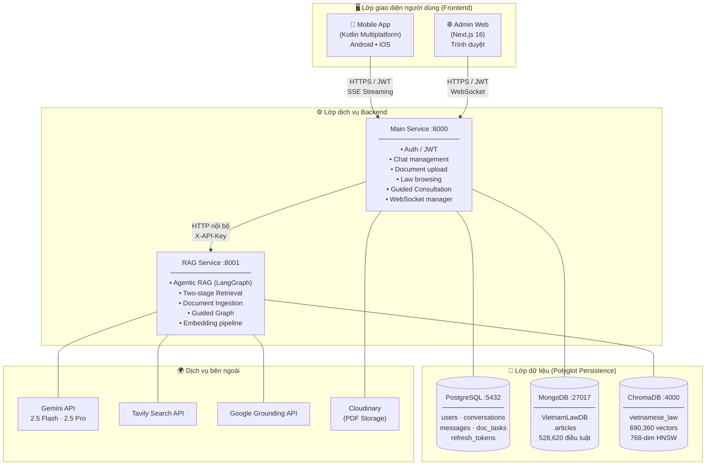
```mermaid
flowchart TD
    subgraph CLIENT["🖥️ Lớp giao diện người dùng (Frontend)"]
        direction LR
        MOBILE["📱 Mobile App\n(Kotlin Multiplatform)\nAndroid • iOS"]
        WEB["🌐 Admin Web\n(Next.js 16)\nTrình duyệt"]
    end

    subgraph BACKEND["⚙️ Lớp dịch vụ Backend"]
        direction LR
        MAIN["Main Service :8000\n─────────────────\n• Auth / JWT\n• Chat management\n• Document upload\n• Law browsing\n• Guided Consultation\n• WebSocket manager"]
        RAG["RAG Service :8001\n─────────────────\n• Agentic RAG (LangGraph)\n• Two-stage Retrieval\n• Document Ingestion\n• Guided Graph\n• Embedding pipeline"]
    end

    subgraph DATA["💾 Lớp dữ liệu (Polyglot Persistence)"]
        direction LR
        PG[("PostgreSQL :5432\n─────────────\nusers · conversations\nmessages · doc_tasks\nrefresh_tokens")]
        MONGO[("MongoDB :27017\n─────────────\nVietnamLawDB\n.articles\n528,620 điều luật")]
        CHROMA[("ChromaDB :4000\n─────────────\nvietnamese_law\n690,360 vectors\n768-dim HNSW")]
    end

    subgraph EXTERNAL["🌍 Dịch vụ bên ngoài"]
        direction LR
        GEMINI["Gemini API\n2.5 Flash · 2.5 Pro"]
        TAVILY["Tavily Search API"]
        GOOGLE["Google Grounding API"]
        CLOUDINARY["Cloudinary\n(PDF Storage)"]
    end

    MOBILE -- "HTTPS / JWT\nSSE Streaming" --> MAIN
    WEB -- "HTTPS / JWT\nWebSocket" --> MAIN
    MAIN -- "HTTP nội bộ\nX-API-Key" --> RAG
    MAIN --- PG
    MAIN --- MONGO
    MAIN --- CLOUDINARY
    RAG --- CHROMA
    RAG --- GEMINI
    RAG --- TAVILY
    RAG --- GOOGLE
```

---

### Hình 2.2. Sơ đồ thành phần Main Service

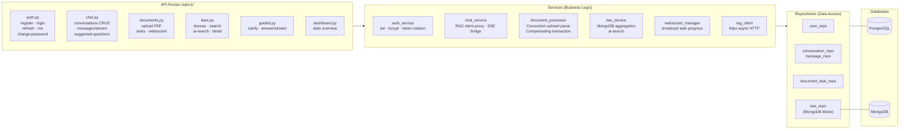
```mermaid
flowchart LR
    subgraph ROUTES["API Routes /api/v1/"]
        R_AUTH["auth.py\nregister · login\nrefresh · me\nchange-password"]
        R_CHAT["chat.py\nconversations CRUD\nmessages/stream\nsuggested-questions"]
        R_DOCS["documents.py\nupload PDF\ntasks · websocket"]
        R_LAWS["laws.py\nbrowse · search\nai-search · detail"]
        R_GUIDED["guided.py\nclarify · answer/stream"]
        R_DASH["dashboard.py\nstats overview"]
    end

    subgraph SERVICES["Services (Business Logic)"]
        S1["auth_service\njwt · bcrypt · token rotation"]
        S2["chat_service\nRAG client proxy · SSE bridge"]
        S3["document_processor\nConcurrent upload+parse\nCompensating transaction"]
        S4["law_service\nMongoDB aggregation\nai-search"]
        S5["websocket_manager\nbroadcast task progress"]
        S6["rag_client\nhttpx async HTTP"]
    end

    subgraph REPOS["Repositories (Data Access)"]
        RP1["user_repo"]
        RP2["conversation_repo\nmessage_repo"]
        RP3["document_task_repo"]
        RP4["law_repo\n(MongoDB Motor)"]
    end

    subgraph DBS["Databases"]
        PG[("PostgreSQL")]
        MDB[("MongoDB")]
    end

    ROUTES --> SERVICES
    SERVICES --> REPOS
    REPOS --- PG
    RP4 --- MDB
```

---

### Hình 2.3. Sơ đồ thành phần RAG Service

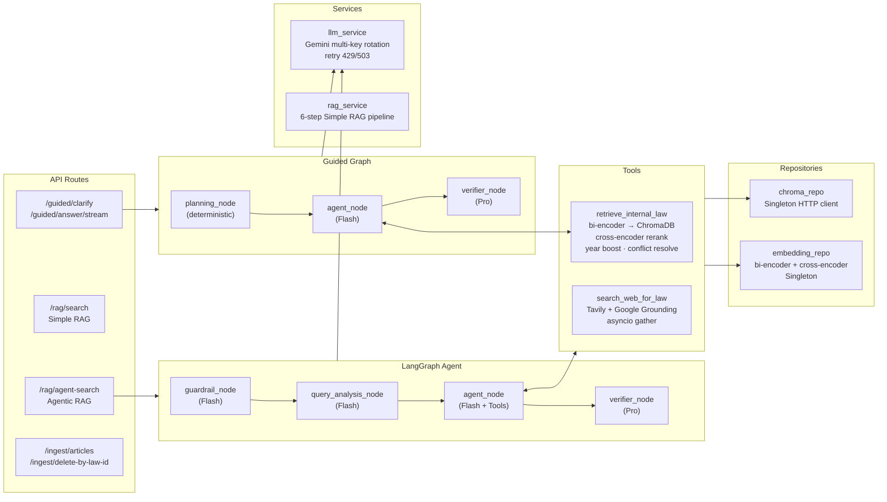
```mermaid
flowchart LR
    subgraph ROUTES2["API Routes"]
        E1["/rag/agent-search\nAgentic RAG"]
        E2["/rag/search\nSimple RAG"]
        E3["/guided/clarify\n/guided/answer/stream"]
        E4["/ingest/articles\n/ingest/delete-by-law-id"]
    end

    subgraph GRAPH["LangGraph Agent"]
        G1["guardrail_node\n(Flash)"]
        G2["query_analysis_node\n(Flash)"]
        G3["agent_node\n(Flash + Tools)"]
        G4["verifier_node\n(Pro)"]
        G1 --> G2 --> G3 --> G4
    end

    subgraph GUIDED["Guided Graph"]
        GD1["planning_node\n(deterministic)"]
        GD2["agent_node\n(Flash)"]
        GD3["verifier_node\n(Pro)"]
        GD1 --> GD2 --> GD3
    end

    subgraph TOOLS["Tools"]
        T1["retrieve_internal_law\nbi-encoder → ChromaDB\ncross-encoder rerank\nyear boost · conflict resolve"]
        T2["search_web_for_law\nTavily + Google Grounding\nasyncio gather"]
    end

    subgraph SERVICES2["Services"]
        SV1["llm_service\nGemini multi-key rotation\nretry 429/503"]
        SV2["rag_service\n6-step Simple RAG pipeline"]
    end

    subgraph REPOS2["Repositories"]
        RP5["chroma_repo\nSingleton HTTP client"]
        RP6["embedding_repo\nbi-encoder + cross-encoder\nSingleton"]
    end

    E1 --> GRAPH
    E3 --> GUIDED
    G3 <--> TOOLS
    GD2 <--> T1
    TOOLS --> RP5
    TOOLS --> RP6
    GRAPH --> SV1
    GUIDED --> SV1
```

---

### Hình 2.4. Đồ thị Agentic RAG — 4 nút LangGraph

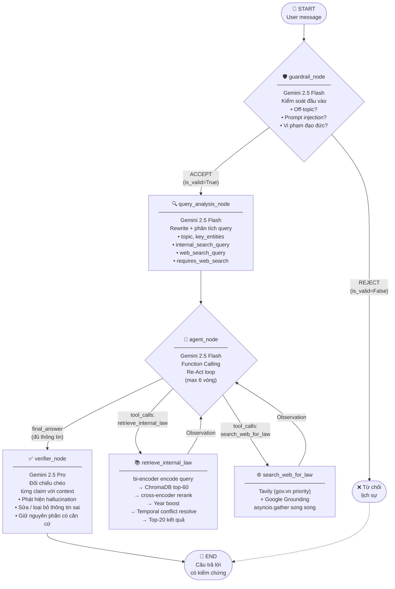
```mermaid
flowchart TD
    START([🚀 START\nUser message]) --> GUARD

    GUARD{"🛡️ guardrail_node\n──────────────\nGemini 2.5 Flash\nKiểm soát đầu vào\n• Off-topic?\n• Prompt injection?\n• Vi phạm đạo đức?"}

    GUARD -- "REJECT\n(is_valid=False)" --> REJECT(["❌ Từ chối\nlịch sự"])
    GUARD -- "ACCEPT\n(is_valid=True)" --> QA

    QA["🔍 query_analysis_node\n──────────────────────\nGemini 2.5 Flash\nRewrite + phân tích query\n• topic, key_entities\n• internal_search_query\n• web_search_query\n• requires_web_search"]

    QA --> AGENT

    AGENT{"🤖 agent_node\n──────────────\nGemini 2.5 Flash\nFunction Calling\nRe-Act loop\n(max 6 vòng)"}

    AGENT -- "tool_calls:\nretrieve_internal_law" --> CHROMA
    AGENT -- "tool_calls:\nsearch_web_for_law" --> WEB

    CHROMA["📚 retrieve_internal_law\n───────────────────────\nbi-encoder encode query\n→ ChromaDB top-60\n→ cross-encoder rerank\n→ Year boost\n→ Temporal conflict resolve\n→ Top-20 kết quả"]

    WEB["🌐 search_web_for_law\n─────────────────────\nTavily (gov.vn priority)\n+ Google Grounding\nasyncio.gather song song"]

    CHROMA -- "Observation" --> AGENT
    WEB -- "Observation" --> AGENT

    AGENT -- "final_answer\n(đủ thông tin)" --> VERIFY

    VERIFY["✅ verifier_node\n──────────────────\nGemini 2.5 Pro\nĐối chiếu chéo\ntừng claim với context\n• Phát hiện hallucination\n• Sửa / loại bỏ thông tin sai\n• Giữ nguyên phần có căn cứ"]

    VERIFY --> END(["🏁 END\nCâu trả lời\ncó kiểm chứng"])

    REJECT -.-> END
```

---

### Hình 2.5. Chi tiết Node Agent — vòng lặp Re-Act

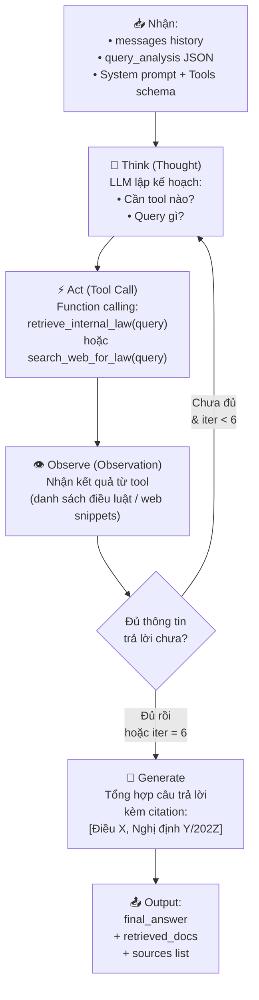
```mermaid
flowchart TD
    IN["📥 Nhận:\n• messages history\n• query_analysis JSON\n• System prompt + Tools schema"]

    IN --> THINK["💭 Think (Thought)\nLLM lập kế hoạch:\n• Cần tool nào?\n• Query gì?"]

    THINK --> CALL["⚡ Act (Tool Call)\nFunction calling:\nretrieve_internal_law(query)\nhoặc search_web_for_law(query)"]

    CALL --> OBS["👁️ Observe (Observation)\nNhận kết quả từ tool\n(danh sách điều luật / web snippets)"]

    OBS --> ENOUGH{"Đủ thông tin\ntrả lời chưa?"}

    ENOUGH -- "Chưa đủ\n& iter < 6" --> THINK
    ENOUGH -- "Đủ rồi\nhoặc iter = 6" --> GEN

    GEN["📝 Generate\nTổng hợp câu trả lời\nkèm citation:\n[Điều X, Nghị định Y/202Z]"]

    GEN --> OUT["📤 Output:\nfinal_answer\n+ retrieved_docs\n+ sources list"]
```

---

### Hình 2.6. Pipeline Truy xuất 2 giai đoạn (Two-Stage Retrieval)

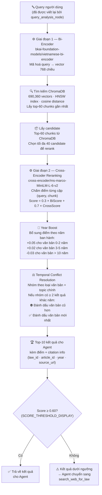
```mermaid
flowchart TD
    QUERY["🔤 Query người dùng\n(đã được viết lại bởi query_analysis_node)"]

    QUERY --> ENC["⚙️ Giai đoạn 1 — Bi-Encoder\nbkai-foundation-models/vietnamese-bi-encoder\nMã hoá query → vector 768 chiều"]

    ENC --> CHROMA_SEARCH["🔍 Tìm kiếm ChromaDB\n690,360 vectors · HNSW index · cosine distance\nLấy top-60 chunks gần nhất"]

    CHROMA_SEARCH --> CANDIDATES["📦 Lấy candidate\nTop-60 chunks từ ChromaDB\nChọn tối đa 40 candidate để rerank"]

    CANDIDATES --> CROSS["⚙️ Giai đoạn 2 — Cross-Encoder Reranking\ncross-encoder/ms-marco-MiniLM-L-6-v2\nChấm điểm từng cặp (query, chunk)\nScore = 0.3 × BiScore + 0.7 × CrossScore"]

    CROSS --> YEAR["📅 Year Boost\nBổ sung điểm theo năm ban hành:\n+0.05 cho văn bản 0-2 năm\n+0.02 cho văn bản 3-5 năm\n-0.03 cho văn bản > 10 năm"]

    YEAR --> CONFLICT["⚖️ Temporal Conflict Resolution\nNhóm theo loại văn bản + topic chính\nNếu nhóm có ≥ 2 kết quả khác năm:\n  ⛔ Đánh dấu văn bản cũ hơn\n  ✅ Đánh dấu văn bản mới nhất"]

    CONFLICT --> TOP10["🏆 Top-10 kết quả cho Agent\nkèm điểm + citation info\n(law_id · article_id · year · source_url)"]

    TOP10 --> THRESHOLD{"Score ≥ 0.60?\n(SCORE_THRESHOLD_DISPLAY)"}

    THRESHOLD -- "Có" --> RETURN["✅ Trả về kết quả\ncho Agent"]
    THRESHOLD -- "Không" --> EMPTY["⚠️ Kết quả dưới ngưỡng\n→ Agent chuyển sang\nsearch_web_for_law"]
```

---

### Hình 2.7. Thuật toán Temporal Conflict Resolution

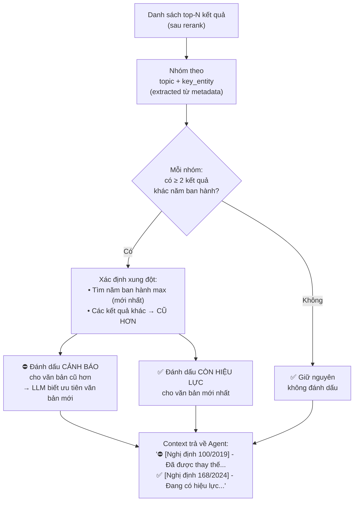
```mermaid
flowchart TD
    INPUT["Danh sách top-N kết quả\n(sau rerank)"]

    INPUT --> GROUP["Nhóm theo\ntopic + key_entity\n(extracted từ metadata)"]

    GROUP --> CHECK{"Mỗi nhóm:\ncó ≥ 2 kết quả\nkhác năm ban hành?"}

    CHECK -- "Không" --> PASS["✅ Giữ nguyên\nkhông đánh dấu"]
    CHECK -- "Có" --> CONFLICT["Xác định xung đột:\n• Tìm năm ban hành max (mới nhất)\n• Các kết quả khác → CŨ HƠN"]

    CONFLICT --> MARK_OLD["⛔ Đánh dấu CẢNH BÁO\ncho văn bản cũ hơn\n→ LLM biết ưu tiên văn bản mới"]
    CONFLICT --> MARK_NEW["✅ Đánh dấu CÒN HIỆU LỰC\ncho văn bản mới nhất"]

    MARK_OLD --> OUT["Context trả về Agent:\n'⛔ [Nghị định 100/2019] - Đã được thay thế...\n✅ [Nghị định 168/2024] - Đang có hiệu lực...'"]
    MARK_NEW --> OUT
    PASS --> OUT
```

---

### Hình 2.8. Luồng Tư vấn có Hướng dẫn (Guided Consultation — 2 bước)

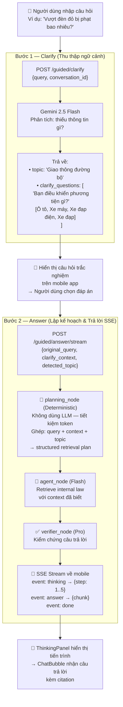
```mermaid
flowchart TD
    USER_Q["👤 Người dùng nhập câu hỏi\nVí dụ: 'Vượt đèn đỏ bị phạt bao nhiêu?'"]

    USER_Q --> STEP1

    subgraph STEP1["Bước 1 — Clarify (Thu thập ngữ cảnh)"]
        S1_API["POST /guided/clarify\n{query, conversation_id}"]
        S1_LLM["Gemini 2.5 Flash\nPhân tích: thiếu thông tin gì?"]
        S1_OUT["Trả về:\n• topic: 'Giao thông đường bộ'\n• clarify_questions: [\n  'Bạn điều khiển phương tiện gì?'\n  [Ô tô, Xe máy, Xe đạp điện, Xe đạp]\n  ]"]
        S1_API --> S1_LLM --> S1_OUT
    end

    S1_OUT --> DISPLAY_Q["📱 Hiển thị câu hỏi trắc nghiệm\ntrên mobile app\n→ Người dùng chọn đáp án"]

    DISPLAY_Q --> STEP2

    subgraph STEP2["Bước 2 — Answer (Lập kế hoạch & Trả lời SSE)"]
        S2_API["POST /guided/answer/stream\n{original_query, clarify_context, detected_topic}"]

        S2_PLAN["🧩 planning_node (Deterministic)\nKhông dùng LLM — tiết kiệm token\nGhép: query + context + topic\n→ structured retrieval plan"]

        S2_AGENT["🤖 agent_node (Flash)\nRetrieve internal law\nvới context đã biết"]

        S2_VERIFY["✅ verifier_node (Pro)\nKiểm chứng câu trả lời"]

        S2_SSE["📡 SSE Stream về mobile\nevent: thinking → {step: 1..5}\nevent: answer → {chunk}\nevent: done"]

        S2_API --> S2_PLAN --> S2_AGENT --> S2_VERIFY --> S2_SSE
    end

    S2_SSE --> MOBILE_UI["📱 ThinkingPanel hiển thị tiến trình\n→ ChatBubble nhận câu trả lời\nkèm citation"]
```

---

### Hình 2.9. Pipeline Document Ingestion với Compensating Transaction

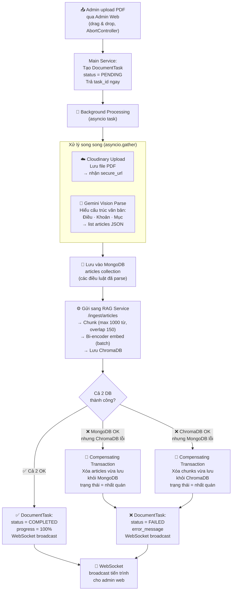
```mermaid
flowchart TD
    UPLOAD["📤 Admin upload PDF\nqua Admin Web\n(drag & drop, AbortController)"]

    UPLOAD --> CREATE_TASK["Main Service:\nTạo DocumentTask\nstatus = PENDING\nTrả task_id ngay"]

    CREATE_TASK --> BG["🔄 Background Processing\n(asyncio task)"]

    BG --> CONCURRENT

    subgraph CONCURRENT["Xử lý song song (asyncio.gather)"]
        direction LR
        CLD["☁️ Cloudinary Upload\nLưu file PDF\n→ nhận secure_url"]
        GEM["🤖 Gemini Vision Parse\nHiểu cấu trúc văn bản:\nĐiều · Khoản · Mục\n→ list articles JSON"]
    end

    CONCURRENT --> MONGO_SAVE["💾 Lưu vào MongoDB\narticles collection\n(các điều luật đã parse)"]

    MONGO_SAVE --> EMBED["⚙️ Gửi sang RAG Service\n/ingest/articles\n→ Chunk (max 1000 từ, overlap 150)\n→ Bi-encoder embed (batch)\n→ Lưu ChromaDB"]

    EMBED --> CHECK{"Cả 2 DB\nthành công?"}

    CHECK -- "✅ Cả 2 OK" --> DONE["✅ DocumentTask:\nstatus = COMPLETED\nprogress = 100%\nWebSocket broadcast"]

    CHECK -- "❌ MongoDB OK\nnhưng ChromaDB lỗi" --> ROLLBACK_MDB["🔄 Compensating Transaction\nXóa articles vừa lưu\nkhỏi MongoDB\ntrạng thái = nhất quán"]

    CHECK -- "❌ ChromaDB OK\nnhưng MongoDB lỗi" --> ROLLBACK_CHROMA["🔄 Compensating Transaction\nXóa chunks vừa lưu\nkhỏi ChromaDB\ntrạng thái = nhất quán"]

    ROLLBACK_MDB --> FAIL["❌ DocumentTask:\nstatus = FAILED\nerror_message\nWebSocket broadcast"]
    ROLLBACK_CHROMA --> FAIL

    DONE --> WS["📡 WebSocket\nbroadcast tiến trình\ncho admin web"]
    FAIL --> WS
```

---

### Hình 2.10. Cơ chế Multi-API-Key Rotation (Gemini)

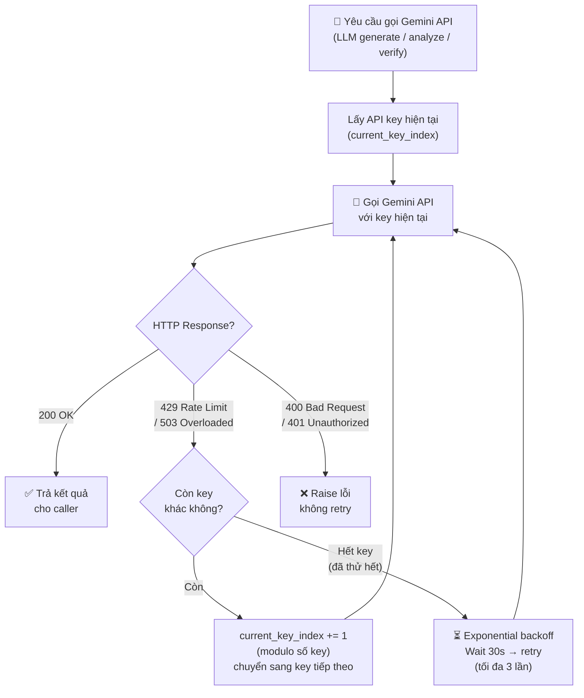
```mermaid
flowchart TD
    REQ["📨 Yêu cầu gọi Gemini API\n(LLM generate / analyze / verify)"]

    REQ --> PICK["Lấy API key hiện tại\n(current_key_index)"]

    PICK --> CALL_API["🔑 Gọi Gemini API\nvới key hiện tại"]

    CALL_API --> RESP{"HTTP Response?"}

    RESP -- "200 OK" --> SUCCESS["✅ Trả kết quả\ncho caller"]

    RESP -- "429 Rate Limit\n/ 503 Overloaded" --> RETRY{"Còn key\nkhác không?"}

    RETRY -- "Còn" --> NEXT["current_key_index += 1\n(modulo số key)\nchuyển sang key tiếp theo"]
    NEXT --> CALL_API

    RETRY -- "Hết key\n(đã thử hết)" --> WAIT["⏳ Exponential backoff\nWait 30s → retry\n(tối đa 3 lần)"]
    WAIT --> CALL_API

    RESP -- "400 Bad Request\n/ 401 Unauthorized" --> ERR["❌ Raise lỗi\nkhông retry"]
```

---

## II. CHƯƠNG 3 — SƠ ĐỒ PHÂN TÍCH & THIẾT KẾ

---

### Hình 3.1. Biểu đồ Use Case tổng quát

> **Ghi chú**: Mermaid không hỗ trợ biểu đồ Use Case UML chuẩn. Sơ đồ dưới đây là biểu đồ chức năng tương đương. Khuyến nghị vẽ thêm phiên bản UML chuẩn trong draw.io với actor hình người và boundary hệ thống.

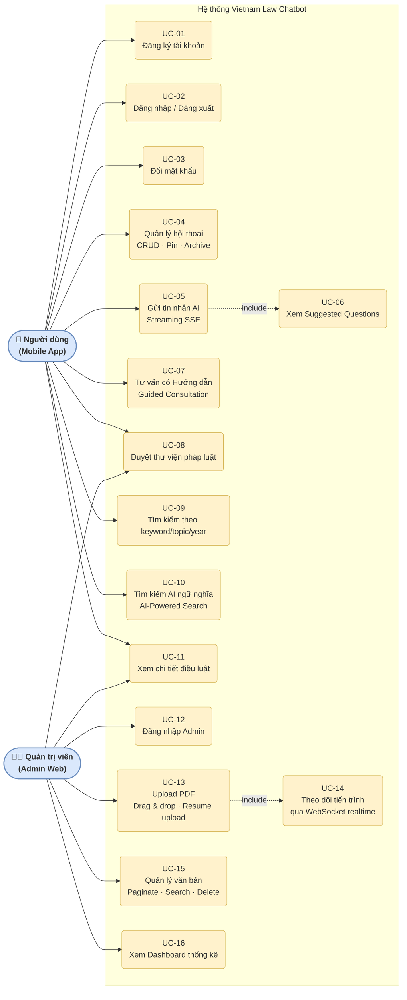
```mermaid
flowchart LR
    classDef actor fill:#dae8fc,stroke:#6c8ebf,stroke-width:2px,font-weight:bold
    classDef usecase fill:#fff2cc,stroke:#d6b656,stroke-width:1px
    classDef system fill:#f8f8f8,stroke:#999,stroke-width:1px,stroke-dasharray:5 5

    USER(["👤 Người dùng\n(Mobile App)"]):::actor
    ADMIN(["👨‍💼 Quản trị viên\n(Admin Web)"]):::actor

    subgraph SYS["Hệ thống Vietnam Law Chatbot"]
        UC01("UC-01\nĐăng ký tài khoản"):::usecase
        UC02("UC-02\nĐăng nhập / Đăng xuất"):::usecase
        UC03("UC-03\nĐổi mật khẩu"):::usecase
        UC04("UC-04\nQuản lý hội thoại\nCRUD · Pin · Archive"):::usecase
        UC05("UC-05\nGửi tin nhắn AI\nStreaming SSE"):::usecase
        UC06("UC-06\nXem Suggested Questions"):::usecase
        UC07("UC-07\nTư vấn có Hướng dẫn\nGuided Consultation"):::usecase
        UC08("UC-08\nDuyệt thư viện pháp luật"):::usecase
        UC09("UC-09\nTìm kiếm theo keyword/topic/year"):::usecase
        UC10("UC-10\nTìm kiếm AI ngữ nghĩa\nAI-Powered Search"):::usecase
        UC11("UC-11\nXem chi tiết điều luật"):::usecase
        UC12("UC-12\nĐăng nhập Admin"):::usecase
        UC13("UC-13\nUpload PDF\nDrag & drop · Resume upload"):::usecase
        UC14("UC-14\nTheo dõi tiến trình\nqua WebSocket realtime"):::usecase
        UC15("UC-15\nQuản lý văn bản\nPaginate · Search · Delete"):::usecase
        UC16("UC-16\nXem Dashboard thống kê"):::usecase
    end

    USER --> UC01
    USER --> UC02
    USER --> UC03
    USER --> UC04
    USER --> UC05
    UC05 -.->|"include"| UC06
    USER --> UC07
    USER --> UC08
    USER --> UC09
    USER --> UC10
    USER --> UC11

    ADMIN --> UC12
    ADMIN --> UC13
    UC13 -.->|"include"| UC14
    ADMIN --> UC15
    ADMIN --> UC16
    ADMIN --> UC08
    ADMIN --> UC11
```

---

### Hình 3.2. Use Case UC-05 — Gửi tin nhắn AI (Streaming SSE)

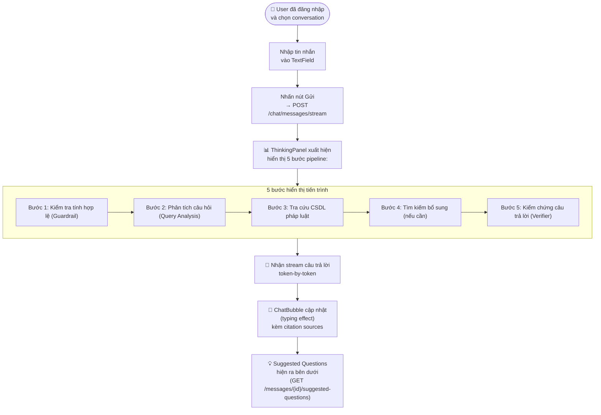
```mermaid
flowchart TD
    START2(["👤 User đã đăng nhập\nvà chọn conversation"])

    START2 --> INPUT["Nhập tin nhắn\nvào TextField"]

    INPUT --> SEND["Nhấn nút Gửi\n→ POST /chat/messages/stream"]

    SEND --> THINKING["📊 ThinkingPanel xuất hiện\nhiển thị 5 bước pipeline:"]

    subgraph STEPS["5 bước hiển thị tiến trình"]
        T1["Bước 1: Kiểm tra tính hợp lệ (Guardrail)"]
        T2["Bước 2: Phân tích câu hỏi (Query Analysis)"]
        T3["Bước 3: Tra cứu CSDL pháp luật"]
        T4["Bước 4: Tìm kiếm bổ sung (nếu cần)"]
        T5["Bước 5: Kiểm chứng câu trả lời (Verifier)"]
        T1 --> T2 --> T3 --> T4 --> T5
    end

    THINKING --> STEPS
    STEPS --> STREAM["📡 Nhận stream câu trả lời\ntoken-by-token"]
    STREAM --> BUBBLE["💬 ChatBubble cập nhật\n(typing effect)\nkèm citation sources"]
    BUBBLE --> SQ["💡 Suggested Questions\nhiện ra bên dưới\n(GET /messages/{id}/suggested-questions)"]
```

---

### Hình 3.3. Use Case UC-13/14 — Upload PDF và WebSocket Tracking

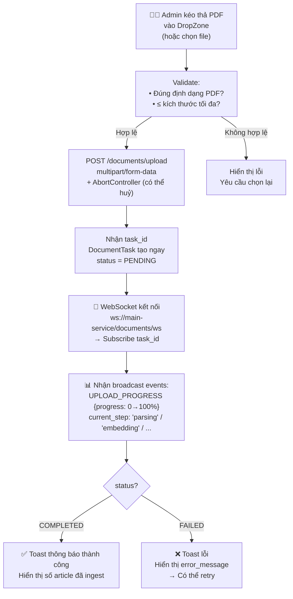
```mermaid
flowchart TD
    DRAG["👨‍💼 Admin kéo thả PDF\nvào DropZone\n(hoặc chọn file)"]

    DRAG --> VALIDATE["Validate:\n• Đúng định dạng PDF?\n• ≤ kích thước tối đa?"]

    VALIDATE -- "Hợp lệ" --> UPLOAD["POST /documents/upload\nmultipart/form-data\n+ AbortController (có thể huỷ)"]

    UPLOAD --> TASK_ID["Nhận task_id\nDocumentTask tạo ngay\nstatus = PENDING"]

    TASK_ID --> WS_CONNECT["🔌 WebSocket kết nối\nws://main-service/documents/ws\n→ Subscribe task_id"]

    WS_CONNECT --> PROGRESS["📊 Nhận broadcast events:\nUPLOAD_PROGRESS {progress: 0→100%}\ncurrent_step: 'parsing' / 'embedding' / ..."]

    PROGRESS --> FINAL{"status?"}

    FINAL -- "COMPLETED" --> SUCCESS2["✅ Toast thông báo thành công\nHiển thị số article đã ingest"]
    FINAL -- "FAILED" --> FAIL2["❌ Toast lỗi\nHiển thị error_message\n→ Có thể retry"]

    VALIDATE -- "Không hợp lệ" --> ERR2["Hiển thị lỗi\nYêu cầu chọn lại"]
```

---

### Hình 3.4. ER Diagram — PostgreSQL (5 bảng)

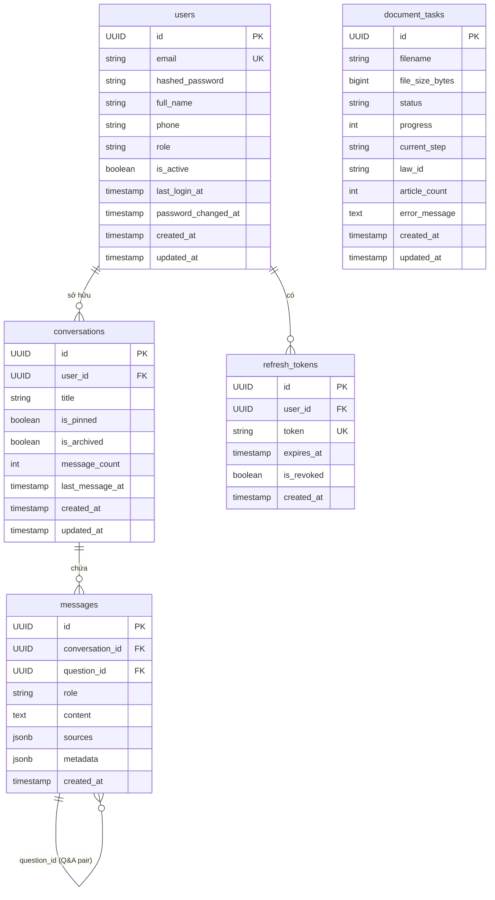
```mermaid
erDiagram
    users {
        UUID id PK
        string email UK
        string hashed_password
        string full_name
        string phone
        string role
        boolean is_active
        timestamp last_login_at
        timestamp password_changed_at
        timestamp created_at
        timestamp updated_at
    }

    conversations {
        UUID id PK
        UUID user_id FK
        string title
        boolean is_pinned
        boolean is_archived
        int message_count
        timestamp last_message_at
        timestamp created_at
        timestamp updated_at
    }

    messages {
        UUID id PK
        UUID conversation_id FK
        UUID question_id FK
        string role
        text content
        jsonb sources
        jsonb metadata
        timestamp created_at
    }

    document_tasks {
        UUID id PK
        string filename
        bigint file_size_bytes
        string status
        int progress
        string current_step
        string law_id
        int article_count
        text error_message
        timestamp created_at
        timestamp updated_at
    }

    refresh_tokens {
        UUID id PK
        UUID user_id FK
        string token UK
        timestamp expires_at
        boolean is_revoked
        timestamp created_at
    }

    users ||--o{ conversations : "sở hữu"
    users ||--o{ refresh_tokens : "có"
    conversations ||--o{ messages : "chứa"
    messages ||--o{ messages : "question_id (Q&A pair)"
```

---

### Hình 3.5. Sơ đồ quan hệ 3 cơ sở dữ liệu

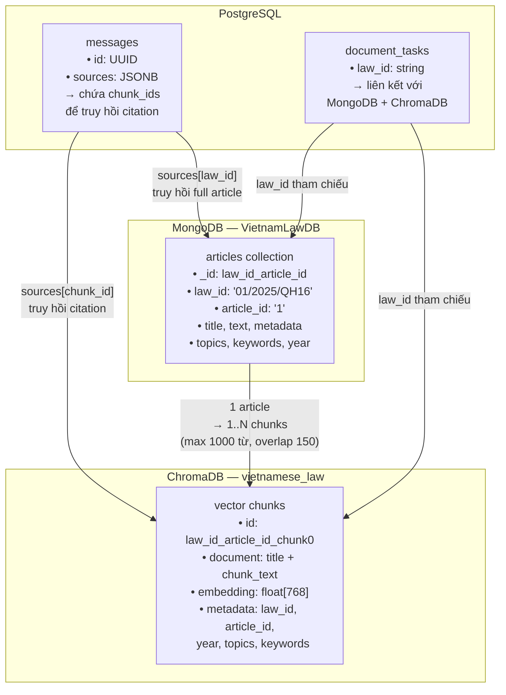
```mermaid
flowchart TB
    subgraph PG2["PostgreSQL"]
        MSG["messages\n• id: UUID\n• sources: JSONB\n  → chứa chunk_ids\n  để truy hồi citation"]
        DTASK["document_tasks\n• law_id: string\n  → liên kết với\n  MongoDB + ChromaDB"]
    end

    subgraph MDB2["MongoDB — VietnamLawDB"]
        ART["articles collection\n• _id: law_id_article_id\n• law_id: '01/2025/QH16'\n• article_id: '1'\n• title, text, metadata\n• topics, keywords, year"]
    end

    subgraph CHR["ChromaDB — vietnamese_law"]
        VEC["vector chunks\n• id: law_id_article_id_chunk0\n• document: title + chunk_text\n• embedding: float[768]\n• metadata: law_id, article_id,\n  year, topics, keywords"]
    end

    ART -- "1 article\n→ 1..N chunks\n(max 1000 từ, overlap 150)" --> VEC
    DTASK -- "law_id tham chiếu" --> ART
    DTASK -- "law_id tham chiếu" --> VEC
    MSG -- "sources[chunk_id]\ntruy hồi citation" --> VEC
    MSG -- "sources[law_id]\ntruy hồi full article" --> ART
```

---

## III. BIỂU ĐỒ TUẦN TỰ (SEQUENCE DIAGRAMS)

---

### SD-01 (Hình 3.6). Luồng Đăng ký + Đăng nhập + JWT Auto-refresh

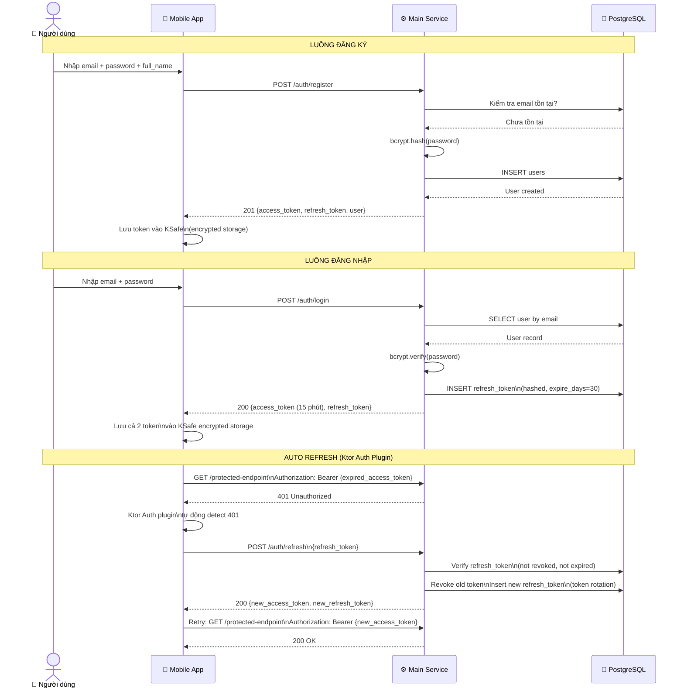
```mermaid
sequenceDiagram
    actor User as 👤 Người dùng
    participant App as 📱 Mobile App
    participant Main as ⚙️ Main Service
    participant DB as 💾 PostgreSQL

    Note over User,DB: LUỒNG ĐĂNG KÝ
    User->>App: Nhập email + password + full_name
    App->>Main: POST /auth/register
    Main->>DB: Kiểm tra email tồn tại?
    DB-->>Main: Chưa tồn tại
    Main->>Main: bcrypt.hash(password)
    Main->>DB: INSERT users
    DB-->>Main: User created
    Main-->>App: 201 {access_token, refresh_token, user}
    App->>App: Lưu token vào KSafe\n(encrypted storage)

    Note over User,DB: LUỒNG ĐĂNG NHẬP
    User->>App: Nhập email + password
    App->>Main: POST /auth/login
    Main->>DB: SELECT user by email
    DB-->>Main: User record
    Main->>Main: bcrypt.verify(password)
    Main->>DB: INSERT refresh_token\n(hashed, expire_days=30)
    Main-->>App: 200 {access_token (15 phút), refresh_token}
    App->>App: Lưu cả 2 token\nvào KSafe encrypted storage

    Note over User,DB: AUTO REFRESH (Ktor Auth Plugin)
    App->>Main: GET /protected-endpoint\nAuthorization: Bearer {expired_access_token}
    Main-->>App: 401 Unauthorized
    App->>App: Ktor Auth plugin\ntự động detect 401
    App->>Main: POST /auth/refresh\n{refresh_token}
    Main->>DB: Verify refresh_token\n(not revoked, not expired)
    Main->>DB: Revoke old token\nInsert new refresh_token\n(token rotation)
    Main-->>App: 200 {new_access_token, new_refresh_token}
    App->>Main: Retry: GET /protected-endpoint\nAuthorization: Bearer {new_access_token}
    Main-->>App: 200 OK
```

---

### SD-02 (Hình 3.7). Luồng Gửi tin nhắn Agentic RAG + SSE Streaming ⭐ QUAN TRỌNG NHẤT

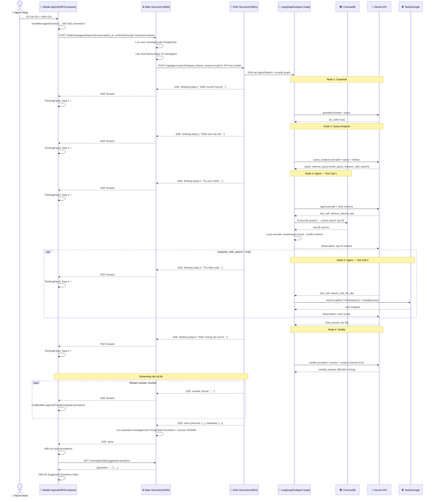
```mermaid
sequenceDiagram
    actor User as 👤 Người dùng
    participant App as 📱 Mobile App\n(KMP/Compose)
    participant Main as ⚙️ Main Service\n(:8000)
    participant RAG as 🤖 RAG Service\n(:8001)
    participant GRAPH as 🔗 LangGraph\nAgent Graph
    participant CHROMA as 📚 ChromaDB
    participant GEMINI as 🌟 Gemini API
    participant WEB as 🌐 Tavily/Google

    User->>App: Gõ câu hỏi + nhấn Gửi
    App->>App: sendMessageStream()\n→ Mở SSE connection
    App->>Main: POST /chat/messages/stream\n{conversation_id, content}\nAccept: text/event-stream

    Main->>Main: Lưu user message\nvào PostgreSQL
    Main->>Main: Lấy chat history\n(last 10 messages)
    Main->>RAG: POST /rag/agent-search\n{query, history, stream=true}\nX-API-Key header

    RAG->>GRAPH: Khởi tạo AgentState\n+ compile graph

    Note over GRAPH,GEMINI: Node 1: Guardrail
    RAG-->>Main: SSE: thinking {step:1, "Kiểm tra tính hợp lệ..."}
    Main-->>App: SSE forward
    App->>App: ThinkingPanel: Step 1 ✓
    GRAPH->>GEMINI: guardrail prompt + query
    GEMINI-->>GRAPH: {is_valid: true}

    Note over GRAPH,GEMINI: Node 2: Query Analysis
    RAG-->>Main: SSE: thinking {step:2, "Phân tích câu hỏi..."}
    Main-->>App: SSE forward
    App->>App: ThinkingPanel: Step 2 ✓
    GRAPH->>GEMINI: query_analysis prompt\n+ query + history
    GEMINI-->>GRAPH: {topic, internal_query,\nweb_query, requires_web_search}

    Note over GRAPH,CHROMA: Node 3: Agent — Tool Call 1
    RAG-->>Main: SSE: thinking {step:3, "Tra cứu CSDL..."}
    Main-->>App: SSE forward
    App->>App: ThinkingPanel: Step 3 ✓
    GRAPH->>GEMINI: agent prompt + tools schema
    GEMINI-->>GRAPH: tool_call: retrieve_internal_law
    GRAPH->>CHROMA: bi-encode query\n→ cosine search top-60
    CHROMA-->>GRAPH: top-60 vectors
    GRAPH->>GRAPH: cross-encoder rerank\nyear boost · conflict resolve
    GRAPH-->>GEMINI: Observation: top-20 articles

    opt requires_web_search = true
        Note over GRAPH,WEB: Node 3: Agent — Tool Call 2
        RAG-->>Main: SSE: thinking {step:4, "Tìm kiếm web..."}
        Main-->>App: SSE forward
        App->>App: ThinkingPanel: Step 4 ✓
        GEMINI-->>GRAPH: tool_call: search_web_for_law
        GRAPH->>WEB: asyncio.gather:\nTavily(query) + Google(query)
        WEB-->>GRAPH: web snippets
        GRAPH-->>GEMINI: Observation: web results
    end

    GEMINI-->>GRAPH: final_answer (sơ bộ)

    Note over GRAPH,GEMINI: Node 4: Verifier
    RAG-->>Main: SSE: thinking {step:5, "Kiểm chứng câu trả lời..."}
    Main-->>App: SSE forward
    App->>App: ThinkingPanel: Step 5 ✓
    GRAPH->>GEMINI: verifier prompt\n+ answer + context (Gemini Pro)
    GEMINI-->>GRAPH: verified_answer (đã kiểm chứng)

    Note over RAG,App: Streaming câu trả lời
    loop Stream answer chunks
        RAG-->>Main: SSE: answer {chunk: "..."}
        Main-->>App: SSE forward
        App->>App: ChatBubble.appendChunk()\n(typing animation)
    end

    RAG-->>Main: SSE: done {sources: [...], metadata: {...}}
    Main->>Main: Lưu assistant message\nvào PostgreSQL\n(content + sources JSONB)
    Main-->>App: SSE: done
    App->>App: Hiển thị sources/citations
    App->>Main: GET /messages/{id}/suggested-questions
    Main-->>App: [{question: "..."}, ...]
    App->>App: Hiển thị Suggested Questions chips
```

---

### SD-03 (Hình 3.8). Luồng Tư vấn có Hướng dẫn (Guided Consultation)

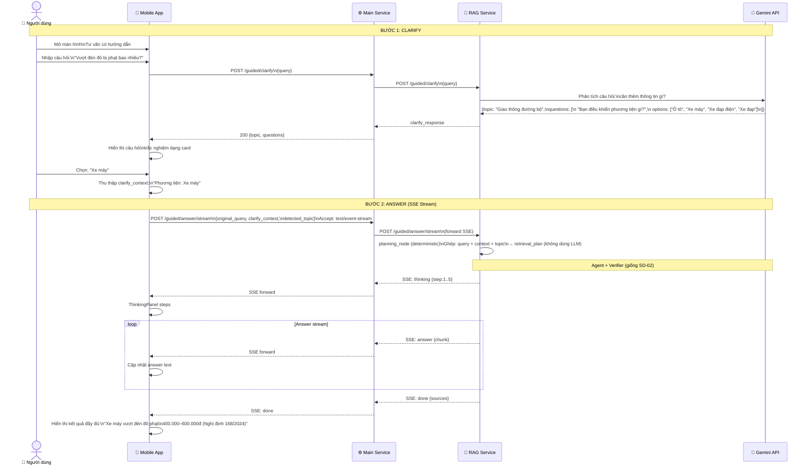
```mermaid
sequenceDiagram
    actor User as 👤 Người dùng
    participant App as 📱 Mobile App
    participant Main as ⚙️ Main Service
    participant RAG as 🤖 RAG Service
    participant GEMINI as 🌟 Gemini API

    Note over User,GEMINI: BƯỚC 1: CLARIFY
    User->>App: Mở màn hình\nTư vấn có hướng dẫn
    User->>App: Nhập câu hỏi:\n"Vượt đèn đỏ bị phạt bao nhiêu?"
    App->>Main: POST /guided/clarify\n{query}

    Main->>RAG: POST /guided/clarify\n{query}
    RAG->>GEMINI: Phân tích câu hỏi:\ncần thêm thông tin gì?
    GEMINI-->>RAG: {topic: "Giao thông đường bộ",\nquestions: [\n  "Bạn điều khiển phương tiện gì?",\n  options: ["Ô tô", "Xe máy", "Xe đạp điện", "Xe đạp"]\n]}
    RAG-->>Main: clarify_response
    Main-->>App: 200 {topic, questions}

    App->>App: Hiển thị câu hỏi\ntrắc nghiệm dạng card
    User->>App: Chọn: "Xe máy"
    App->>App: Thu thập clarify_context:\n"Phương tiện: Xe máy"

    Note over User,GEMINI: BƯỚC 2: ANSWER (SSE Stream)
    App->>Main: POST /guided/answer/stream\n{original_query, clarify_context,\ndetected_topic}\nAccept: text/event-stream

    Main->>RAG: POST /guided/answer/stream\n(forward SSE)

    RAG->>RAG: planning_node (deterministic)\nGhép: query + context + topic\n→ retrieval_plan (không dùng LLM)

    Note over RAG,GEMINI: Agent + Verifier (giống SD-02)
    RAG-->>Main: SSE: thinking {step:1..5}
    Main-->>App: SSE forward
    App->>App: ThinkingPanel steps

    loop Answer stream
        RAG-->>Main: SSE: answer {chunk}
        Main-->>App: SSE forward
        App->>App: Cập nhật answer text
    end

    RAG-->>Main: SSE: done {sources}
    Main-->>App: SSE: done
    App->>App: Hiển thị kết quả đầy đủ:\n"Xe máy vượt đèn đỏ phạt\n400.000–600.000đ (Nghị định 168/2024)"
```

---

### SD-04 (Hình 3.9). Luồng AI-Powered Search (Tìm kiếm ngữ nghĩa)

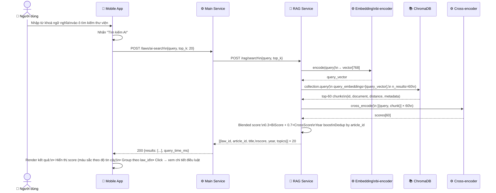
```mermaid
sequenceDiagram
    actor User as 👤 Người dùng
    participant App as 📱 Mobile App
    participant Main as ⚙️ Main Service
    participant RAG as 🤖 RAG Service
    participant EMB as ⚙️ Embedding\nbi-encoder
    participant CHR as 📚 ChromaDB
    participant CROSS as ⚙️ Cross-encoder

    User->>App: Nhập từ khoá ngữ nghĩa\nvào ô tìm kiếm thư viện
    App->>App: Nhấn "Tìm kiếm AI"
    App->>Main: POST /laws/ai-search\n{query, top_k: 20}

    Main->>RAG: POST /rag/search\n{query, top_k}

    RAG->>EMB: encode(query)\n→ vector[768]
    EMB-->>RAG: query_vector

    RAG->>CHR: collection.query(\n  query_embeddings=[query_vector],\n  n_results=60\n)
    CHR-->>RAG: top-60 chunks\n(id, document, distance, metadata)

    RAG->>CROSS: cross_encode(\n  [(query, chunk)] × 60\n)
    CROSS-->>RAG: scores[60]

    RAG->>RAG: Blended score:\n0.3×BiScore + 0.7×CrossScore\nYear boost\nDedup by article_id

    RAG-->>Main: [{law_id, article_id, title,\nscore, year, topics}] × 20

    Main-->>App: 200 {results: [...], query_time_ms}
    App->>App: Render kết quả:\n• Hiển thị score (màu sắc theo độ tin cậy)\n• Group theo law_id\n• Click → xem chi tiết điều luật
```

---

### SD-05 (Hình 3.10). Luồng Upload PDF + Ingest (Concurrent + Compensating Transaction)

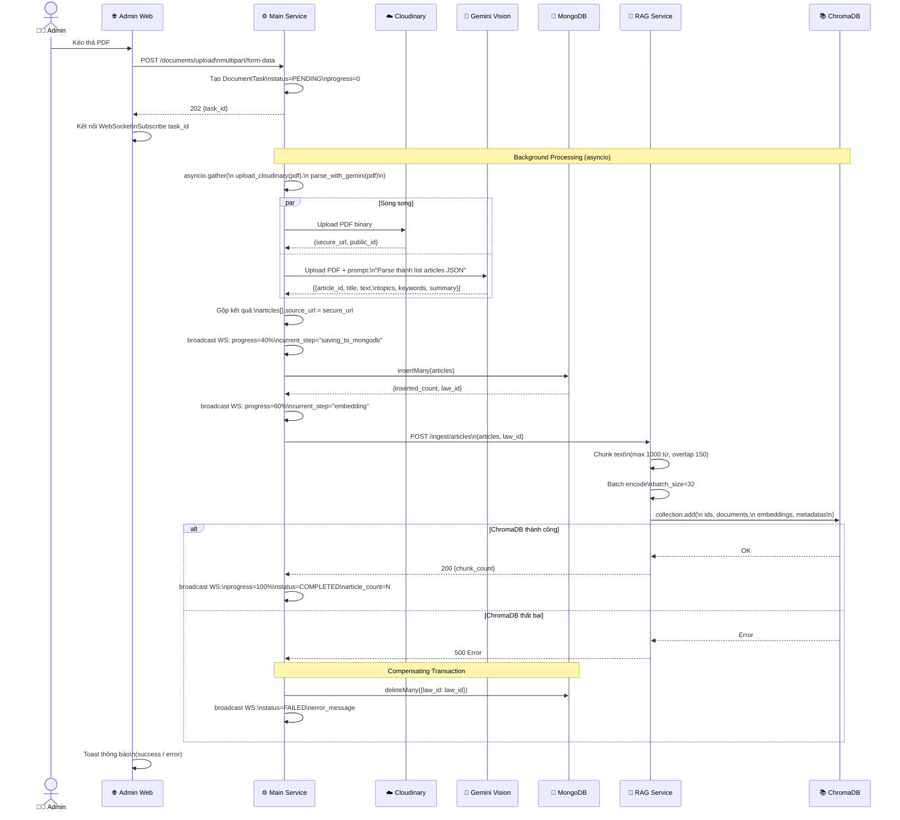
```mermaid
sequenceDiagram
    actor Admin as 👨‍💼 Admin
    participant Web as 🌐 Admin Web
    participant Main as ⚙️ Main Service
    participant CLD as ☁️ Cloudinary
    participant GEMINI as 🤖 Gemini Vision
    participant MDB as 💾 MongoDB
    participant RAG as 🤖 RAG Service
    participant CHR as 📚 ChromaDB

    Admin->>Web: Kéo thả PDF
    Web->>Main: POST /documents/upload\nmultipart/form-data

    Main->>Main: Tạo DocumentTask\nstatus=PENDING\nprogress=0

    Main-->>Web: 202 {task_id}
    Web->>Web: Kết nối WebSocket\nSubscribe task_id

    Note over Main,CHR: Background Processing (asyncio)
    Main->>Main: asyncio.gather(\n  upload_cloudinary(pdf),\n  parse_with_gemini(pdf)\n)

    par Song song
        Main->>CLD: Upload PDF binary
        CLD-->>Main: {secure_url, public_id}
    and
        Main->>GEMINI: Upload PDF + prompt:\n"Parse thành list articles JSON"
        GEMINI-->>Main: [{article_id, title, text,\ntopics, keywords, summary}]
    end

    Main->>Main: Gộp kết quả:\narticles[].source_url = secure_url

    Main->>Main: broadcast WS: progress=40%\ncurrent_step="saving_to_mongodb"

    Main->>MDB: insertMany(articles)
    MDB-->>Main: {inserted_count, law_id}

    Main->>Main: broadcast WS: progress=60%\ncurrent_step="embedding"

    Main->>RAG: POST /ingest/articles\n{articles, law_id}

    RAG->>RAG: Chunk text\n(max 1000 từ, overlap 150)
    RAG->>RAG: Batch encode\nbatch_size=32
    RAG->>CHR: collection.add(\n  ids, documents,\n  embeddings, metadatas\n)

    alt ChromaDB thành công
        CHR-->>RAG: OK
        RAG-->>Main: 200 {chunk_count}
        Main->>Main: broadcast WS:\nprogress=100%\nstatus=COMPLETED\narticle_count=N
    else ChromaDB thất bại
        CHR-->>RAG: Error
        RAG-->>Main: 500 Error
        Note over Main,MDB: Compensating Transaction
        Main->>MDB: deleteMany({law_id: law_id})
        Main->>Main: broadcast WS:\nstatus=FAILED\nerror_message
    end

    Web->>Web: Toast thông báo\n(success / error)
```

---

### SD-06 (Hình 3.11). Luồng Theo dõi Task qua WebSocket

```mermaid
sequenceDiagram
    actor Admin as 👨‍💼 Admin
    participant Web as 🌐 Admin Web
    participant WS as 🔌 WebSocket\nManager
    participant Main as ⚙️ Main Service

    Admin->>Web: Mở trang Documents
    Web->>Web: WebSocketProvider mount\n(useEffect)

    Web->>WS: ws://localhost:8000/documents/ws\nUpgrade: websocket

    WS-->>Web: 101 Switching Protocols\nConnected

    Note over Web,WS: Auto-reconnect logic
    loop Heartbeat / Keep-alive
        WS-->>Web: ping
        Web-->>WS: pong
    end

    Note over Admin,Main: Admin upload file (xem SD-05)
    Main->>WS: broadcast({type: "UPLOAD_PROGRESS",\ntask_id, progress: 25,\ncurrent_step: "parsing"})
    WS-->>Web: JSON event
    Web->>Web: Update ProgressBar → 25%

    Main->>WS: broadcast({type: "UPLOAD_PROGRESS",\ntask_id, progress: 60,\ncurrent_step: "embedding"})
    WS-->>Web: JSON event
    Web->>Web: Update ProgressBar → 60%

    Main->>WS: broadcast({type: "UPLOAD_STATUS",\ntask_id, status: "COMPLETED",\narticle_count: 47})
    WS-->>Web: JSON event
    Web->>Web: Toast: "Upload thành công! 47 điều luật"\nStatus badge → COMPLETED

    Note over Web,WS: Disconnect khi unmount
    Web->>WS: Close connection
    WS-->>Web: 1000 Normal Closure
```

---

### SD-07 (Hình 3.12). Luồng Suggested Questions

```mermaid
sequenceDiagram
    actor User as 👤 Người dùng
    participant App as 📱 Mobile App
    participant Main as ⚙️ Main Service
    participant RAG as 🤖 RAG Service
    participant GEMINI as 🌟 Gemini API

    Note over User,GEMINI: Xảy ra SAU KHI nhận xong câu trả lời AI (SD-02 done)

    App->>App: SSE done event nhận được\nassistant message đã lưu\n→ message_id có sẵn

    App->>Main: GET /messages/{message_id}/suggested-questions

    Main->>RAG: POST /rag/suggest-questions\n{message_id, content, sources}

    RAG->>GEMINI: Prompt:\n"Dựa trên câu trả lời và context,\nđề xuất 3 câu hỏi tiếp theo\nngười dùng có thể muốn hỏi"
    GEMINI-->>RAG: [{question: "..."}, {question: "..."}, {question: "..."}]

    RAG-->>Main: [{question}, {question}, {question}]
    Main-->>App: 200 {suggestions: [...]}

    App->>App: Render SuggestionChips:\n[Chip("Mức phạt xe máy...")] \n[Chip("Điểm trừ GPLX?")] \n[Chip("Tái phạm xử lý thế nào?")]

    User->>App: Nhấn vào 1 chip
    App->>App: Tự động điền câu hỏi\nvào TextField → gửi
    Note over App,GEMINI: Tiếp tục như luồng SD-02
```

---

### SD-08 (Hình 3.13). Luồng Duyệt thư viện + Xem chi tiết điều luật

```mermaid
sequenceDiagram
    actor User as 👤 Người dùng
    participant App as 📱 Mobile App
    participant Main as ⚙️ Main Service
    participant MDB as 💾 MongoDB

    Note over User,MDB: DUYỆT DANH SÁCH VĂN BẢN
    User->>App: Mở màn hình Thư viện pháp luật
    App->>Main: GET /laws?page=1&limit=20\n&year=2024&topic=Giao+thông
    Main->>MDB: db.articles.aggregate([\n  {$match: {metadata.year: "2024"}},\n  {$group: {_id: "$law_id", ...}},\n  {$project: {summary, topic, year}},\n  {$sort: {year: -1}},\n  {$skip: 0, $limit: 20}\n])
    MDB-->>Main: [{law_id, title, year, topics[]}]
    Main-->>App: 200 {laws: [...], total, page}
    App->>App: Render danh sách văn bản\n(LazyColumn / infinite scroll)

    Note over User,MDB: XEM CHI TIẾT VĂN BẢN
    User->>App: Nhấn vào 1 văn bản
    App->>Main: GET /laws/{law_id}/articles?page=1
    Main->>MDB: db.articles.aggregate([\n  {$match: {law_id: law_id}},\n  {$sort: {article_id: 1}},\n  {$skip: 0, $limit: 50}\n])
    MDB-->>Main: [{article_id, title, text, metadata}]
    Main-->>App: 200 {articles: [...]}
    App->>App: Render danh sách điều luật\n(clickable items)

    Note over User,MDB: XEM NỘI DUNG 1 ĐIỀU
    User->>App: Nhấn vào 1 điều luật
    App->>Main: GET /laws/{law_id}/articles/{article_id}
    Main->>MDB: db.articles.findOne(\n  {_id: law_id_article_id}\n)
    MDB-->>Main: full article document
    Main-->>App: 200 {article}
    App->>App: Render ArticleDetailScreen\nHiển thị title + full text\n+ topics + keywords\n+ source_url (PDF link)
```

---

## IV. SƠ ĐỒ BỔ SUNG

---

### Hình P.1. Kiến trúc MVI trên Mobile App (Kotlin Multiplatform)

```mermaid
flowchart LR
    subgraph UI["Compose UI Layer"]
        SCREEN["Screen\n@Composable"]
    end

    subgraph VM["ViewModel (MVI)"]
        STATE["UiState\n(StateFlow)"]
        INTENT["MVIIntent\n(sealed interface)"]
        EFFECT["MVIEffect\n(Channel → SharedFlow)"]
        LOGIC["Business Logic\n+ Use Cases"]
    end

    subgraph DATA2["Data Layer"]
        REPO2["Repository"]
        API["Ktor HTTP Client\n(JWT Auth plugin)"]
        SSE["SSE Client\n(callbackFlow)"]
        DB2["KSafe\n(Encrypted Storage)"]
    end

    SCREEN -- "dispatch(intent)" --> INTENT
    INTENT --> LOGIC
    LOGIC -- "setState()" --> STATE
    LOGIC -- "sendEffect()" --> EFFECT
    STATE -- "collectAsState()" --> SCREEN
    EFFECT -- "collectLatest()" --> SCREEN

    LOGIC --> REPO2
    REPO2 --> API
    REPO2 --> SSE
    REPO2 --> DB2
```

---

### Hình P.2. Kiến trúc triển khai Docker Compose

```mermaid
flowchart TB
    subgraph DOCKER["Docker Compose Network"]
        subgraph FRONT["Frontend (ports exposed)"]
            ADM["admin-frontend\n:3000"]
        end

        subgraph SVC["Backend Services (ports exposed)"]
            MS["main-service\n:8000"]
            RS["rag-service\n:8001"]
        end

        subgraph DBS3["Databases"]
            PG3["postgres:16-alpine\n:5432"]
            MDB3["mongo:7\n:27017"]
            CHR3["chromadb/chroma\n:4000→8000"]
        end

        subgraph VOLS["Named Volumes"]
            V1["postgres_data"]
            V2["mongo_data"]
            V3["chroma_data"]
            V4["upload_data"]
            V5["model_cache\n(bi-encoder + cross-encoder)"]
        end
    end

    ADM -- "HTTP :8000/api/v1\n(browser direct)" --> MS
    MS -- "Docker network\nhttp://rag-service:8001" --> RS
    MS --- PG3
    MS --- MDB3
    RS -- "Docker network\nhttp://chromadb:8000" --> CHR3

    PG3 --- V1
    MDB3 --- V2
    CHR3 --- V3
    MS --- V4
    RS --- V5
```

---

*— Hết file _Diagrams.md —*
