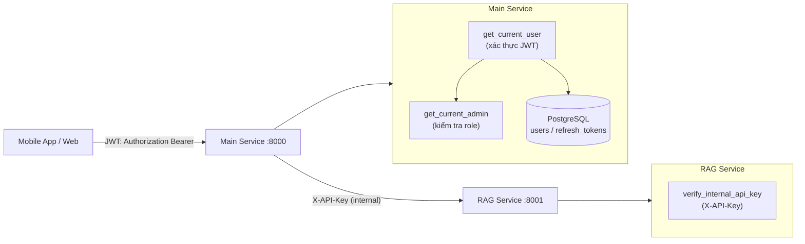

# Luồng xác thực và phân quyền của hệ thống

Tài liệu này mô tả luồng xác thực (Authentication) và phân quyền (Authorization) của hệ thống trợ lý ảo tư vấn pháp luật. Nội dung trải dài từ lúc người dùng đăng ký tài khoản, đăng nhập, sử dụng access token để gọi API, làm mới token khi hết hạn, đổi mật khẩu, đăng xuất, cho đến cơ chế phân quyền giữa người dùng thường và quản trị viên, và cuối cùng là lớp xác thực nội bộ giữa hai service. Tài liệu được viết để người ngoài dự án vẫn có thể hiểu được hệ thống bảo vệ tài nguyên như thế nào và vì sao lại thiết kế như vậy.

## 1. Vai trò của luồng xác thực và phân quyền

Trợ lý pháp luật là một hệ thống nhiều người dùng. Mỗi người dùng có hội thoại riêng, lịch sử chat riêng và quyền hạn riêng. Vì vậy hệ thống cần một cơ chế để trả lời ba câu hỏi cốt lõi:

- Người gửi request là ai (Authentication - xác thực danh tính).
- Người đó được phép làm gì (Authorization - phân quyền).
- Làm sao để các thành phần backend tin tưởng lẫn nhau mà không phơi RAG Service ra ngoài Internet (xác thực nội bộ giữa service).

Hệ thống có hai lớp xác thực tách biệt rõ ràng:

- Lớp ngoài: Client (mobile app, web) xác thực với Main Service bằng JWT, gồm một access token ngắn hạn và một refresh token dài hạn.
- Lớp trong: Main Service xác thực với RAG Service bằng API key nội bộ qua header `X-API-Key`. RAG Service không bao giờ nhận request trực tiếp từ client.

Việc tách hai lớp này giúp RAG Service - nơi chứa pipeline AI, khóa LLM và kho tri thức - không phải tự xử lý JWT của người dùng, đồng thời không bị lộ ra ngoài. Mọi quyền của người dùng cuối được kiểm soát tại Main Service.

Ngoài ra, hệ thống còn phân biệt hai vai trò người dùng:

- `user`: người dùng thường, được phép chat, quản lý hội thoại của chính mình, xem và cập nhật thông tin cá nhân.
- `admin`: quản trị viên, ngoài quyền của user còn được phép upload và quản lý văn bản pháp luật, xem dashboard quản trị.

## 2. Tổng quan các thành phần tham gia

Luồng xác thực được triển khai hoàn toàn trong Main Service và được tổ chức theo nhiều lớp:

```text
Client
-> API layer (auth.py)            : nhận request, định dạng response
-> Service layer (auth_service.py): nghiệp vụ đăng ký, đăng nhập, refresh, đổi mật khẩu
-> Core security (security.py)    : hash mật khẩu, tạo/giải mã JWT, sinh refresh token
-> Core dependencies (dependencies.py): get_current_user, get_current_admin
-> Repository layer               : user_repository.py, refresh_token_repository.py
-> PostgreSQL                     : bảng users, refresh_tokens
```

Việc chia lớp giúp tách bạch trách nhiệm: API chỉ lo định dạng request/response, Service lo nghiệp vụ, Repository lo truy cập dữ liệu, còn Core chứa các tiện ích bảo mật dùng chung. Cách tổ chức này lặp lại nhất quán với các luồng khác của hệ thống (chat, laws, documents).

## 3. Các endpoint của luồng xác thực

Tất cả endpoint xác thực nằm dưới prefix `/api/v1/auth` và được định nghĩa trong `main-service/app/api/v1/auth.py`:

```http
POST /api/v1/auth/signup           Đăng ký tài khoản mới
POST /api/v1/auth/login            Đăng nhập, trả access + refresh token
POST /api/v1/auth/refresh          Làm mới token (xoay refresh token)
POST /api/v1/auth/logout           Đăng xuất một thiết bị (thu hồi 1 refresh token)
POST /api/v1/auth/logout-all       Đăng xuất tất cả thiết bị
GET  /api/v1/auth/me               Lấy thông tin user hiện tại
PUT  /api/v1/auth/me               Cập nhật thông tin user
PUT  /api/v1/auth/change-password  Đổi mật khẩu
```

Có một điểm thiết kế đáng chú ý ngay từ danh sách này:

- `signup`, `login`, `refresh`, `logout` là endpoint công khai (không yêu cầu access token), vì người dùng chưa đăng nhập hoặc đang trong trạng thái cần lấy token mới.
- `logout-all`, `me` (GET/PUT), `change-password` yêu cầu access token hợp lệ, vì các thao tác này gắn với một danh tính cụ thể. Điều này được đảm bảo bằng dependency `get_current_user`.

## 4. Đăng ký tài khoản (signup)

Khi người dùng đăng ký, client gửi request tới `POST /api/v1/auth/signup` với email, mật khẩu và các thông tin tùy chọn. Endpoint gọi `AuthService.register`:

```python
async def register(self, data: RegisterRequest) -> UserResponse:
    """Register a new user."""
    # Check if email exists
    email_str = str(data.email).lower()
    existing_user = await self.user_repo.get_by_email(email_str)
    if existing_user:
        raise BadRequestException("Email already registered")

    # Check if phone exists (if provided)
    if data.phone_number:
        existing_phone = await self.user_repo.get_by_phone(data.phone_number)
        if existing_phone:
            raise BadRequestException("Phone number already registered")

    # Create user
    user = User(
        email=email_str,
        hashed_password=hash_password(data.password),
        full_name=data.full_name,
        phone_number=data.phone_number,
        role="user",
    )

    user = await self.user_repo.create(user)

    return self._user_to_response(user)
```

LÝ DO THIẾT KẾ:

- Email được chuẩn hóa về chữ thường (`email.lower()`) ngay từ đầu, đồng bộ với việc cột `email` trong bảng `users` là `unique`. Nhờ đó hệ thống tránh được trường hợp hai tài khoản trùng email nhưng khác hoa/thường.
- Mật khẩu KHÔNG bao giờ được lưu dạng nguyên văn. Trường lưu trong CSDL là `hashed_password`, giá trị được tạo bởi `hash_password(data.password)`.
- Người dùng mới luôn được gán `role="user"`. Không có cách nào để tự đăng ký trở thành admin qua API này, đây là một biện pháp phân quyền an toàn theo mặc định (secure by default). Admin chỉ được tạo bằng script riêng (`scripts/create_admin.py`).
- Việc kiểm tra trùng email và trùng số điện thoại tách riêng giúp trả về thông báo lỗi cụ thể cho từng trường.

Schema `RegisterRequest` trong `app/schemas/auth.py` ràng buộc dữ liệu đầu vào ngay tại tầng API:

```python
class RegisterRequest(BaseModel):
    """Register request schema."""
    email: EmailStr
    password: str = Field(..., min_length=6, max_length=100)
    full_name: Optional[str] = Field(None, max_length=255)
    phone_number: Optional[str] = Field(None, max_length=20)

    @field_validator("phone_number")
    @classmethod
    def validate_phone(cls, v: Optional[str]) -> Optional[str]:
        if v is None:
            return None
        # Remove spaces and dashes
        v = re.sub(r"[\s\-]", "", v)
        # Check if valid phone number (Vietnamese format)
        if not re.match(r"^(\+84|84|0)[0-9]{9,10}$", v):
            raise ValueError("Invalid phone number format")
        return v
```

Pydantic kiểm tra email đúng định dạng (`EmailStr`), mật khẩu dài tối thiểu 6 ký tự, và số điện thoại theo định dạng Việt Nam (`+84`, `84` hoặc `0` rồi 9-10 chữ số). Nhờ đặt validation ở schema, dữ liệu sai bị chặn trước khi vào tầng nghiệp vụ.

## 5. Hash mật khẩu bằng bcrypt

Đây là một trong những điểm bảo mật quan trọng nhất. Hệ thống dùng thuật toán băm mật khẩu **bcrypt** (qua thư viện `bcrypt`), được triển khai trong `main-service/app/core/security.py`:

```python
def hash_password(password: str) -> str:
    """Hash a password using bcrypt."""
    import bcrypt
    password_bytes = password.encode('utf-8')
    salt = bcrypt.gensalt()
    hashed = bcrypt.hashpw(password_bytes, salt)
    return hashed.decode('utf-8')


def verify_password(plain_password: str, hashed_password: str) -> bool:
    """Verify a password against a hash."""
    import bcrypt
    try:
        password_bytes = plain_password.encode('utf-8')
        hashed_bytes = hashed_password.encode('utf-8')
        return bcrypt.checkpw(password_bytes, hashed_bytes)
    except Exception:
        return False
```

LÝ DO THIẾT KẾ:

- bcrypt là thuật toán băm mật khẩu chuyên dụng, được thiết kế chậm có chủ đích để chống lại tấn công brute-force và dò bằng GPU. Khác với các hàm băm nhanh như MD5 hay SHA-256, bcrypt cố tình tốn chi phí tính toán cao.
- Mỗi mật khẩu được băm với một `salt` ngẫu nhiên do `bcrypt.gensalt()` tạo ra. Salt được nhúng ngay trong chuỗi hash kết quả, nên khi xác thực không cần lưu salt riêng. Nhờ salt, hai người dùng đặt cùng mật khẩu vẫn có chuỗi hash khác nhau, chống tấn công rainbow table.
- `verify_password` so khớp mật khẩu nhập vào với hash đã lưu bằng `bcrypt.checkpw`. Hàm này bọc trong `try/except` và trả `False` khi có lỗi, để một hash hỏng hoặc dữ liệu bất thường không làm sập tiến trình đăng nhập mà chỉ coi như xác thực thất bại.

Một điểm cần nhấn mạnh: hệ thống không có chức năng "lấy lại mật khẩu cũ", vì bcrypt là hàm một chiều, không thể giải ngược. Khi quên mật khẩu, người dùng chỉ có thể đặt mật khẩu mới.

## 6. Đăng nhập (login) và sinh cặp token

Khi đăng nhập, client gửi email và mật khẩu tới `POST /api/v1/auth/login`. Logic nằm trong `AuthService.login`:

```python
async def login(self, data: LoginRequest) -> TokenResponse:
    """Login and return tokens."""
    # Find user
    email_str = str(data.email).lower()
    user = await self.user_repo.get_by_email(email_str)

    if not user:
        raise AuthException("Invalid email or password")

    if not verify_password(data.password, user.hashed_password):
        raise AuthException("Invalid email or password")

    if not user.is_active:
        raise AuthException("User account is disabled")

    # Update last login
    await self.user_repo.update_last_login(str(user.id))

    # Create tokens
    return await self._create_tokens(user)
```

LÝ DO THIẾT KẾ:

- Khi không tìm thấy user và khi sai mật khẩu, hệ thống trả về CÙNG một thông báo "Invalid email or password". Đây là kỹ thuật chống dò tài khoản: kẻ tấn công không thể phân biệt được email có tồn tại hay không qua thông báo lỗi.
- Sau khi xác thực mật khẩu, hệ thống còn kiểm tra `is_active`. Tài khoản bị khóa không thể đăng nhập dù mật khẩu đúng.
- `update_last_login` ghi lại thời điểm đăng nhập gần nhất, phục vụ thống kê và theo dõi.
- Chỉ khi cả ba điều kiện (tồn tại, đúng mật khẩu, đang hoạt động) đều thỏa, hệ thống mới sinh cặp token.

## 7. Cơ chế tạo access token và refresh token

Hàm `_create_tokens` trong `auth_service.py` là trung tâm của việc cấp token. Nó được dùng chung cho cả login và refresh:

```python
async def _create_tokens(self, user: User) -> TokenResponse:
    """Create access and refresh tokens."""
    # Create access token
    access_token = create_access_token(
        data={"sub": str(user.id), "role": user.role}
    )

    # Create refresh token
    refresh_token_str, expires_at = create_refresh_token()

    # Save refresh token to database
    refresh_token = RefreshToken(
        user_id=user.id,
        token=refresh_token_str,
        expires_at=expires_at,
    )
    await self.token_repo.create(refresh_token)

    return TokenResponse(
        access_token=access_token,
        refresh_token=refresh_token_str,
        token_type="bearer",
        expires_in=settings.access_token_expire_minutes * 60,
    )
```

Hệ thống dùng mô hình hai loại token với vai trò khác nhau:

- Access token: JWT ngắn hạn, mang theo danh tính và vai trò người dùng. Được gửi kèm trong mọi request cần xác thực. Không lưu trong CSDL (stateless).
- Refresh token: chuỗi ngẫu nhiên dài hạn, được lưu trong PostgreSQL. Dùng để xin access token mới khi access token hết hạn (stateful, có thể thu hồi).

LÝ DO THIẾT KẾ mô hình hai token:

- Access token ngắn hạn giảm thiệt hại nếu bị lộ: kẻ tấn công chỉ dùng được trong thời gian rất ngắn. Vì nó stateless, mỗi request không phải truy vấn CSDL để kiểm tra token, giúp giảm tải.
- Refresh token dài hạn giúp người dùng không phải đăng nhập lại liên tục. Vì nó được lưu trong CSDL, hệ thống có thể chủ động thu hồi (logout, đổi mật khẩu), điều mà JWT thuần túy không làm được.

Trường `expires_in` trả về cho client là `settings.access_token_expire_minutes * 60`, tức thời hạn của access token tính bằng giây.

## 8. Cấu trúc và thuật toán ký JWT access token

Access token được tạo bằng `create_access_token` trong `security.py`:

```python
def create_access_token(data: dict, expires_delta: Optional[timedelta] = None) -> str:
    """Create a JWT access token."""
    to_encode = data.copy()

    now = datetime.now(timezone.utc)
    if expires_delta:
        expire = now + expires_delta
    else:
        expire = now + timedelta(minutes=settings.access_token_expire_minutes)

    to_encode.update({
        "exp": expire,
        "iat": now.timestamp(),
        "type": "access"
    })
    encoded_jwt = jwt.encode(to_encode, settings.jwt_secret, algorithm=settings.jwt_algorithm)

    return encoded_jwt
```

Payload của access token gồm các trường:

- `sub`: ID người dùng (UUID dạng chuỗi), do `_create_tokens` truyền vào.
- `role`: vai trò người dùng (`user` hoặc `admin`).
- `exp`: thời điểm hết hạn.
- `iat`: thời điểm phát hành (issued at), lưu dưới dạng timestamp.
- `type`: luôn là `"access"` để phân biệt với các loại token khác.

Token được ký bằng thuật toán lấy từ cấu hình. Theo `app/core/config.py`, giá trị mặc định là:

```python
jwt_secret: str = "your-secret-key-here"
jwt_algorithm: str = "HS256"
access_token_expire_minutes: int = 30
refresh_token_expire_days: int = 7
```

LÝ DO THIẾT KẾ:

- Thuật toán ký là **HS256** (HMAC-SHA256), một thuật toán đối xứng: cùng một `jwt_secret` vừa dùng để ký vừa dùng để xác minh. Phù hợp khi cùng một service (Main Service) vừa phát hành vừa xác minh token.
- Thời hạn access token mặc định là **30 phút**, refresh token mặc định là **7 ngày**. Khoảng cách lớn này thể hiện đúng triết lý: access token sống ngắn để an toàn, refresh token sống dài để tiện dụng.
- Trường `iat` không chỉ để biết token phát hành khi nào, mà còn là nền tảng cho cơ chế vô hiệu hóa token cũ khi đổi mật khẩu (xem mục 14).
- `jwt_secret` mặc định trong code chỉ là giá trị placeholder; trong môi trường thật phải được ghi đè bằng biến môi trường, nếu không bất kỳ ai biết secret đều có thể tự ký token giả.

## 9. Cấu trúc refresh token

Khác với access token, refresh token KHÔNG phải là JWT. Nó là một chuỗi ngẫu nhiên không mang thông tin, được tạo bởi `create_refresh_token`:

```python
def create_refresh_token() -> Tuple[str, datetime]:
    """Create a refresh token and its expiry time."""
    token = secrets.token_urlsafe(64)
    expires_at = datetime.now(timezone.utc) + timedelta(days=settings.refresh_token_expire_days)
    return token, expires_at
```

LÝ DO THIẾT KẾ:

- `secrets.token_urlsafe(64)` sinh ra chuỗi ngẫu nhiên an toàn mặt mã hóa (cryptographically secure), không thể đoán trước. Vì refresh token là "chìa khóa" để lấy access token mới, nó phải khó đoán hơn cả.
- Refresh token không mang payload nào (không chứa user_id trong bản thân chuỗi). Toàn bộ ý nghĩa của nó nằm ở bản ghi trong CSDL. Đây chính là điều giúp nó có thể bị thu hồi: chỉ cần đánh dấu bản ghi tương ứng là đã thu hồi.
- Hàm trả về cả chuỗi token lẫn thời điểm hết hạn để service lưu vào CSDL.

Bản ghi refresh token được lưu trong bảng `refresh_tokens`, định nghĩa tại `app/models/refresh_token.py`:

```python
class RefreshToken(Base):
    __tablename__ = "refresh_tokens"

    id: Mapped[uuid.UUID] = mapped_column(
        UUID(as_uuid=True),
        primary_key=True,
        default=uuid.uuid4,
    )
    user_id: Mapped[uuid.UUID] = mapped_column(
        UUID(as_uuid=True),
        ForeignKey("users.id", ondelete="CASCADE"),
        nullable=False,
        index=True,
    )
    token: Mapped[str] = mapped_column(
        String(500),
        unique=True,
        index=True,
        nullable=False,
    )
    expires_at: Mapped[datetime] = mapped_column(
        DateTime(timezone=True),
        nullable=False,
    )
    is_revoked: Mapped[bool] = mapped_column(
        Boolean,
        default=False,
    )
    created_at: Mapped[datetime] = mapped_column(
        DateTime(timezone=True),
        server_default=func.now(),
    )
```

Các điểm quan trọng:

- `token` là `unique` và có `index`, vì hệ thống thường xuyên tra cứu refresh token theo chính chuỗi token.
- `is_revoked` là cờ thu hồi. Khi `True`, token không còn dùng được dù chưa hết hạn.
- `expires_at` cho phép tự hết hạn theo thời gian.
- Khóa ngoại `user_id` với `ondelete="CASCADE"`: khi xóa user thì tất cả refresh token của họ tự động bị xóa theo.

Như vậy một refresh token được coi là hợp lệ khi và chỉ khi: tồn tại trong CSDL, chưa bị thu hồi (`is_revoked == False`), và chưa hết hạn.

## 10. Làm mới token và xoay refresh token (refresh rotation)

Khi access token hết hạn, client không cần bắt người dùng đăng nhập lại mà gửi refresh token tới `POST /api/v1/auth/refresh`. Logic nằm trong `AuthService.refresh_token`:

```python
async def refresh_token(self, refresh_token_str: str) -> TokenResponse:
    """Refresh access token using refresh token."""
    # Validate refresh token
    is_valid = await self.token_repo.is_valid(refresh_token_str)
    if not is_valid:
        raise AuthException("Invalid or expired refresh token")

    # Get refresh token record
    refresh_token = await self.token_repo.get_by_token(refresh_token_str)
    if not refresh_token:
        raise AuthException("Refresh token not found")

    # Get user
    user = await self.user_repo.get_by_id(str(refresh_token.user_id))
    if not user or not user.is_active:
        raise AuthException("User not found or disabled")

    # Revoke old refresh token
    await self.token_repo.revoke(refresh_token_str)

    # Create new tokens
    return await self._create_tokens(user)
```

Đây là một trong những điểm quan trọng nhất của tài liệu. Cơ chế ở đây là **refresh token rotation** (xoay refresh token):

1. Hệ thống kiểm tra refresh token hợp lệ (`is_valid`).
2. Lấy bản ghi token và truy ra user tương ứng.
3. Kiểm tra user còn tồn tại và còn hoạt động.
4. **Thu hồi refresh token cũ** (`revoke`).
5. Sinh CẶP token MỚI hoàn toàn (cả access token mới lẫn refresh token mới).

LÝ DO THIẾT KẾ refresh rotation:

- Mỗi refresh token chỉ dùng được một lần. Sau khi dùng để refresh, nó bị thu hồi ngay và client nhận về refresh token mới để dùng cho lần sau.
- Cơ chế này giúp phát hiện và hạn chế tấn công đánh cắp token. Nếu kẻ tấn công đánh cắp refresh token và dùng trước, thì khi người dùng thật dùng lại refresh token cũ (đã bị thu hồi), request sẽ thất bại - đây là dấu hiệu cho thấy token đã bị lộ.
- Việc kiểm tra `user.is_active` ngay tại bước refresh đảm bảo một tài khoản bị khóa không thể tiếp tục gia hạn phiên dù còn giữ refresh token cũ.

Hàm `is_valid` trong `refresh_token_repository.py` gom đủ ba điều kiện hợp lệ:

```python
async def is_valid(self, token: str) -> bool:
    """Check if a refresh token is valid."""
    refresh_token = await self.get_by_token(token)

    if not refresh_token:
        return False

    if refresh_token.is_revoked:
        return False

    if refresh_token.expires_at < datetime.now(timezone.utc):
        return False

    return True
```

Token chỉ hợp lệ khi tồn tại trong CSDL, chưa bị thu hồi và chưa hết hạn. Đây là điểm khác biệt căn bản giữa refresh token (stateful, kiểm tra bằng CSDL) và access token (stateless, kiểm tra bằng chữ ký).

## 11. Đăng xuất một thiết bị (logout)

Đăng xuất chỉ đơn giản là thu hồi refresh token. Endpoint `POST /api/v1/auth/logout` gọi:

```python
async def logout(self, refresh_token_str: str) -> bool:
    """Logout - revoke refresh token."""
    return await self.token_repo.revoke(refresh_token_str)
```

Và hàm `revoke` trong repository chỉ cập nhật cờ `is_revoked` thành `True`:

```python
async def revoke(self, token: str) -> bool:
    """Revoke a refresh token."""
    stmt = (
        update(RefreshToken)
        .where(RefreshToken.token == token)
        .values(is_revoked=True)
    )
    result = await self.db.execute(stmt)
    await self.db.commit()
    return result.rowcount > 0
```

LÝ DO THIẾT KẾ:

- Hệ thống không XÓA bản ghi token mà chỉ đánh dấu thu hồi. Cách này giữ lại lịch sử token để có thể kiểm toán sau này, đồng thời đơn giản hơn về mặt thao tác.
- Sau khi refresh token bị thu hồi, client không thể refresh được nữa. Access token cũ vẫn còn hiệu lực cho đến khi hết hạn (tối đa 30 phút), nhưng không thể gia hạn. Đây là sự đánh đổi cố hữu của mô hình JWT stateless: logout không tức thì vô hiệu access token, mà chặn việc kéo dài phiên.

Endpoint logout là công khai (chỉ cần refresh token trong body), không yêu cầu access token. Điều này hợp lý vì người dùng có thể muốn logout ngay cả khi access token đã hết hạn.

## 12. Đăng xuất tất cả thiết bị (logout-all)

Khi người dùng muốn đăng xuất khỏi mọi thiết bị (ví dụ nghi ngờ tài khoản bị xâm nhập), endpoint `POST /api/v1/auth/logout-all` thu hồi toàn bộ refresh token của họ:

```python
async def logout_all(self, user_id: str) -> int:
    """Logout from all devices - revoke all refresh tokens."""
    return await self.token_repo.revoke_all_for_user(user_id)
```

Repository thu hồi hàng loạt bằng một câu lệnh UPDATE duy nhất:

```python
async def revoke_all_for_user(self, user_id: str) -> int:
    """Revoke all refresh tokens for a user."""
    stmt = (
        update(RefreshToken)
        .where(RefreshToken.user_id == uuid.UUID(user_id))
        .values(is_revoked=True)
    )
    result = await self.db.execute(stmt)
    await self.db.commit()
    return result.rowcount
```

Endpoint trả về số thiết bị đã đăng xuất:

```python
@router.post("/logout-all")
async def logout_all(
        current_user: Annotated[User, Depends(get_current_user)],
        db: Annotated[AsyncSession, Depends(get_db)],
):
    """Đăng xuất khỏi tất cả thiết bị."""
    auth_service = AuthService(db)
    count = await auth_service.logout_all(str(current_user.id))
    return success_response(
        data={"devices_logged_out": count},
        message=f"Đã đăng xuất khỏi {count} thiết bị",
    )
```

LÝ DO THIẾT KẾ:

- Khác với logout thường (truyền refresh token trong body), logout-all yêu cầu `get_current_user`. Lý do là thao tác này tác động lên toàn bộ phiên của user, nên hệ thống phải biết chắc chắn ai đang yêu cầu - và họ phải đang đăng nhập hợp lệ.
- `rowcount` trả về số bản ghi bị ảnh hưởng, tức số phiên/thiết bị bị đăng xuất, giúp phản hồi rõ ràng cho người dùng.

## 13. Đổi mật khẩu (change-password)

Đổi mật khẩu là thao tác nhạy cảm, gắn liền với bảo mật phiên đăng nhập. Logic nằm trong `AuthService.change_password`:

```python
async def change_password(self, user_id: str, data: ChangePasswordRequest) -> bool:
    """Change user password."""
    from datetime import datetime, timezone

    user = await self.user_repo.get_by_id(user_id)
    if not user:
        raise NotFoundException("User")

    # Verify current password
    if not verify_password(data.current_password, user.hashed_password):
        raise AuthException("Current password is incorrect")

    # Update password and password_changed_at
    user.hashed_password = hash_password(data.new_password)
    user.password_changed_at = datetime.now(timezone.utc)
    await self.user_repo.update(user)

    # Revoke all refresh tokens (security)
    await self.token_repo.revoke_all_for_user(user_id)

    return True
```

LÝ DO THIẾT KẾ:

- Trước khi đổi, hệ thống yêu cầu nhập đúng mật khẩu hiện tại (`verify_password`). Điều này chống trường hợp kẻ tấn công chiếm được access token nhưng không biết mật khẩu cũ vẫn đổi được mật khẩu.
- Sau khi đổi, hệ thống ghi lại mốc thời gian `password_changed_at`. Đây là chìa khóa để vô hiệu hóa toàn bộ access token cũ (xem mục 14).
- Hệ thống thu hồi TẤT CẢ refresh token của user (`revoke_all_for_user`). Đây là lý do thông báo trả về là "Đổi mật khẩu thành công. Vui lòng đăng nhập lại." - mọi phiên cũ đều bị chấm dứt.

Schema `ChangePasswordRequest` còn chặn việc đặt lại đúng mật khẩu cũ:

```python
class ChangePasswordRequest(BaseModel):
    """Change password request schema."""
    current_password: str
    new_password: str = Field(..., min_length=6, max_length=100)

    @field_validator("new_password")
    @classmethod
    def validate_new_password(cls, v: str, info) -> str:
        if "current_password" in info.data and v == info.data["current_password"]:
            raise ValueError("New password must be different from current password")
        return v
```

## 14. Vô hiệu hóa access token cũ sau khi đổi mật khẩu

Như đã nói, đổi mật khẩu thu hồi mọi refresh token, nhưng access token là stateless nên không thể "thu hồi" trong CSDL. Hệ thống giải quyết bằng một cơ chế thông minh: so sánh mốc `password_changed_at` với `iat` của token. Cơ chế này nằm trong dependency `get_current_user` (`app/core/dependencies.py`):

```python
# Check if password was changed after token was issued
token_iat = payload.get("iat")
if user.password_changed_at and token_iat:
    if user.password_changed_at.timestamp() > token_iat:
        raise HTTPException(
            status_code=status.HTTP_401_UNAUTHORIZED,
            detail={
                "success": False,
                "message": "Mật khẩu đã được thay đổi. Vui lòng đăng nhập lại.",
                "data": None,
                "error": {
                    "code": "AUTH_1002",
                    "message": "Mật khẩu đã được thay đổi. Vui lòng đăng nhập lại.",
                    "field": None,
                },
            },
        )
```

LÝ DO THIẾT KẾ:

- Mọi access token đều mang `iat` (thời điểm phát hành). Khi user đổi mật khẩu, `password_changed_at` được cập nhật.
- Nếu một access token được phát hành TRƯỚC thời điểm đổi mật khẩu (`password_changed_at > iat`), nó bị từ chối ngay lập tức, dù chữ ký JWT vẫn hợp lệ và chưa hết hạn.
- Đây chính là cách hệ thống "thu hồi" access token cũ mà không cần lưu chúng vào CSDL. Kết hợp với việc thu hồi refresh token, đổi mật khẩu trở thành thao tác chấm dứt hoàn toàn mọi phiên cũ gần như tức thì.

## 15. Lấy và cập nhật thông tin người dùng (me)

Endpoint `GET /api/v1/auth/me` trả về thông tin của chính người dùng đang đăng nhập:

```python
@router.get("/me")
async def get_me(
        current_user: Annotated[User, Depends(get_current_user)],
        db: Annotated[AsyncSession, Depends(get_db)],
):
    """Lấy thông tin user hiện tại."""
    auth_service = AuthService(db)
    user = await auth_service.get_current_user(str(current_user.id))
    return success_response(
        data={
            "id": str(user.id),
            "email": user.email,
            "full_name": user.full_name,
            "phone_number": user.phone_number,
            "role": user.role,
            "is_active": user.is_active,
            "created_at": user.created_at.isoformat(),
            "last_login_at": user.last_login_at.isoformat() if user.last_login_at else None,
        },
        message="Lấy thông tin thành công",
    )
```

Endpoint `PUT /api/v1/auth/me` cho phép cập nhật `full_name` và `phone_number`, xử lý trong `AuthService.update_user`:

```python
async def update_user(self, user_id: str, data: UserUpdateRequest) -> UserResponse:
    """Update user info."""
    user = await self.user_repo.get_by_id(user_id)
    if not user:
        raise NotFoundException("User")

    # Check phone uniqueness if updating
    if data.phone_number and data.phone_number != user.phone_number:
        existing_phone = await self.user_repo.get_by_phone(data.phone_number)
        if existing_phone:
            raise BadRequestException("Phone number already registered")

    # Update fields
    if data.full_name is not None:
        user.full_name = data.full_name
    if data.phone_number is not None:
        user.phone_number = data.phone_number

    user = await self.user_repo.update(user)

    return self._user_to_response(user)
```

LÝ DO THIẾT KẾ:

- Người dùng chỉ thao tác với thông tin của CHÍNH MÌNH. `user_id` luôn lấy từ `current_user` (suy ra từ token), không bao giờ lấy từ body request. Do đó không có cách nào để một user sửa thông tin của user khác qua endpoint này.
- Email và role KHÔNG nằm trong `UserUpdateRequest`, nên người dùng không thể tự đổi email định danh hay tự nâng quyền lên admin.
- Khi đổi số điện thoại, hệ thống kiểm tra trùng để giữ tính duy nhất.

## 16. Dependency get_current_user - cổng xác thực mọi request

`get_current_user` là dependency được dùng ở hầu hết endpoint cần đăng nhập (chat, hội thoại, logout-all, me, change-password). Nó là nơi tập trung toàn bộ logic xác thực access token. Mở đầu hàm:

```python
async def get_current_user(
    credentials: Annotated[HTTPAuthorizationCredentials, Depends(security)],
    db: Annotated[AsyncSession, Depends(get_db)],
) -> User:
    """Get current authenticated user."""
    token = credentials.credentials

    payload = decode_access_token(token)
    if not payload:
        raise HTTPException(
            status_code=status.HTTP_401_UNAUTHORIZED,
            detail={ ... "code": "AUTH_1003" ... },
        )

    user_id = payload.get("sub")
    if not user_id:
        raise HTTPException(... "code": "AUTH_1003" ...)

    user_repo = UserRepository(db)
    user = await user_repo.get_by_id(user_id)

    if not user:
        raise HTTPException(... "code": "AUTH_1004" ...)

    if not user.is_active:
        raise HTTPException(... "code": "AUTH_1006" ...)
```

`security = HTTPBearer()` ở đầu file đảm bảo token phải được gửi qua header chuẩn:

```http
Authorization: Bearer <access_token>
```

Trình tự kiểm tra của `get_current_user`:

1. Giải mã và xác minh JWT (`decode_access_token`). Nếu hỏng hoặc hết hạn, trả lỗi `AUTH_1003`.
2. Lấy `sub` (user_id) từ payload. Thiếu thì trả lỗi.
3. Tra user trong CSDL. Không tìm thấy trả lỗi `AUTH_1004` (token hợp lệ nhưng user đã bị xóa).
4. Kiểm tra `is_active`. Tài khoản bị khóa trả lỗi `AUTH_1006`.
5. Kiểm tra `password_changed_at` so với `iat` (đã trình bày ở mục 14).

LÝ DO THIẾT KẾ: dependency tập trung mọi kiểm tra xác thực vào một chỗ, các endpoint chỉ cần khai báo `Depends(get_current_user)` là tự động được bảo vệ. Điều này tránh lặp code và tránh sót kiểm tra ở từng endpoint.

Hàm giải mã token `decode_access_token` trong `security.py` cũng kiểm tra loại token:

```python
def decode_access_token(token: str) -> Optional[dict]:
    """Decode and verify a JWT access token."""
    try:
        payload = jwt.decode(token, settings.jwt_secret, algorithms=[settings.jwt_algorithm])

        if payload.get("type") != "access":
            return None

        return payload
    except JWTError:
        return None
```

Điểm đáng chú ý: hàm kiểm tra `payload.get("type") != "access"`. Vì refresh token không phải JWT nên không thể vượt qua đây, nhưng kiểm tra `type` vẫn là một lớp phòng vệ rõ ràng để đảm bảo chỉ token đúng loại "access" mới được chấp nhận làm token xác thực.

## 17. Phân quyền admin với get_current_admin

Phân quyền (Authorization) được triển khai bằng dependency `get_current_admin`, xây trên nền `get_current_user`:

```python
async def get_current_admin(
    current_user: Annotated[User, Depends(get_current_user)],
) -> User:
    """Get current admin user."""
    if current_user.role != "admin":
        raise HTTPException(
            status_code=status.HTTP_403_FORBIDDEN,
            detail={
                "success": False,
                "message": "Không có quyền truy cập",
                "data": None,
                "error": {
                    "code": "AUTH_1005",
                    "message": "Không có quyền truy cập",
                    "field": None,
                },
            },
        )
    return current_user
```

LÝ DO THIẾT KẾ:

- `get_current_admin` không xác thực lại token từ đầu, mà tái sử dụng `get_current_user` rồi chỉ kiểm tra thêm điều kiện `role == "admin"`. Đây là kiểu xếp tầng dependency rất gọn: ai vượt qua được `get_current_admin` thì chắc chắn đã vượt qua được `get_current_user`.
- Phân biệt rõ hai mã lỗi và hai mã HTTP:
  - `401 Unauthorized` (AUTH_1003/1004/1006): "bạn là ai chưa rõ" - lỗi xác thực.
  - `403 Forbidden` (AUTH_1005): "biết bạn là ai rồi nhưng bạn không đủ quyền" - lỗi phân quyền.

Trong thực tế, `get_current_admin` được dùng để bảo vệ các endpoint quản trị nhạy cảm. Theo mã nguồn, nó được áp dụng cho các endpoint upload và quản lý văn bản trong `main-service/app/api/v1/documents.py`, ví dụ:

```python
@router.post("/upload")
async def upload_document(
        file: Annotated[UploadFile, File(description="PDF or text file to upload")],
        current_user: Annotated[User, Depends(get_current_admin)],  # Only admin can upload
):
```

Các endpoint upload (`/upload`, `/upload-v2`), xóa và quản lý văn bản, cũng như dashboard quản trị (`app/api/v1/dashboard.py`) đều yêu cầu `get_current_admin`. Như vậy chỉ admin mới có thể đưa văn bản pháp luật mới vào kho tri thức. Người dùng thường chỉ có quyền chat và tra cứu, không thể can thiệp vào dữ liệu nền của hệ thống.

## 18. Lớp xác thực nội bộ giữa Main Service và RAG Service

Đây là lớp xác thực thứ hai, hoàn toàn tách biệt với JWT. Khi Main Service gọi RAG Service (ví dụ để chạy pipeline Agentic RAG), nó không dùng JWT của người dùng mà dùng một API key nội bộ. Cơ chế xác minh phía RAG Service nằm trong `rag-service/app/core/internal_auth.py`:

```python
async def verify_internal_api_key(
        x_api_key: Annotated[Optional[str], Header(alias="X-API-Key")] = None,
        x_internal_service: Annotated[Optional[str], Header(alias="X-Internal-Service")] = None,
) -> bool:
    """
    Verify internal API key for service-to-service communication.

    Headers required:
    - X-API-Key: Internal API key
    - X-Internal-Service: Service name (optional, for logging)
    """
    if not settings.allow_internal_calls:
        raise HTTPException(
            status_code=status.HTTP_403_FORBIDDEN,
            detail="Internal calls not allowed",
        )

    if not x_api_key:
        raise HTTPException(
            status_code=status.HTTP_401_UNAUTHORIZED,
            detail="X-API-Key header required",
        )

    if x_api_key != settings.internal_api_key:
        raise HTTPException(
            status_code=status.HTTP_401_UNAUTHORIZED,
            detail="Invalid API key",
        )

    return True


# Dependency for internal endpoints
InternalAuth = Annotated[bool, Depends(verify_internal_api_key)]
```

Trình tự kiểm tra:

1. Nếu cấu hình `allow_internal_calls` bị tắt, mọi gọi nội bộ bị chặn (`403`). Đây là công tắc an toàn để có thể vô hiệu hóa kênh nội bộ khi cần.
2. Thiếu header `X-API-Key` thì trả `401`.
3. API key không khớp `settings.internal_api_key` thì trả `401`.

Dependency này được đóng gói thành `InternalAuth` và áp dụng cho các endpoint nội bộ của RAG Service. Theo mã nguồn, nó được dùng tại `rag-service/app/api/v1/rag_stream.py` (endpoint agent-search/stream), `rag.py` (các endpoint search, health) và `ingest.py` (ingest và xóa văn bản). Nghĩa là MỌI endpoint của RAG Service đều được bảo vệ bằng API key nội bộ.

Phía Main Service, khi gọi RAG Service, nó gắn các header tương ứng (theo `rag_client.py`):

```http
X-API-Key: <internal_api_key>
X-Internal-Service: main-service
Accept: text/event-stream
```

LÝ DO THIẾT KẾ hai lớp xác thực tách biệt:

- Người dùng cuối chỉ biết và chỉ làm việc với Main Service bằng JWT. RAG Service không bao giờ phơi ra Internet và không xử lý JWT của người dùng.
- Việc dùng API key nội bộ (đối xứng, chia sẻ giữa hai service) đơn giản và đủ an toàn cho giao tiếp backend-to-backend trong môi trường tin cậy.
- Header `X-Internal-Service` cho biết service nào đang gọi, hữu ích cho logging và truy vết, nhưng không phải yếu tố quyết định xác thực (chỉ `X-API-Key` mới quyết định).

## 19. Sơ đồ tổng quát hai lớp xác thực



Có thể mô tả bằng văn bản như sau:

```text
Client -> Main Service:    xác thực bằng JWT access token
                           (get_current_user / get_current_admin)
Main Service -> RAG Service: xác thực bằng X-API-Key nội bộ
                           (verify_internal_api_key)
```

## 20. Tóm tắt các luồng chính

Luồng đăng ký và đăng nhập:

```text
signup -> kiểm tra trùng email/phone -> hash bcrypt -> tạo user (role=user)
login  -> tìm user -> verify_password -> kiểm tra is_active
       -> update_last_login -> tạo access token (JWT) + refresh token (random, lưu DB)
```

Luồng dùng và gia hạn token:

```text
Mỗi request bảo vệ:
  Authorization: Bearer <access_token>
  -> get_current_user: decode JWT, kiểm tra type/sub/user/is_active/password_changed_at

Access token hết hạn:
  POST /refresh với refresh_token
  -> is_valid? -> thu hồi refresh token cũ -> cấp access + refresh token MỚI (rotation)
```

Luồng đăng xuất và đổi mật khẩu:

```text
logout       -> revoke 1 refresh token
logout-all   -> revoke tất cả refresh token của user (yêu cầu đăng nhập)
change-password -> verify mật khẩu cũ -> hash mật khẩu mới
             -> set password_changed_at -> revoke tất cả refresh token
             -> access token cũ tự bị từ chối vì iat < password_changed_at
```

Luồng phân quyền:

```text
user  -> chat, quản lý hội thoại của mình, xem/sửa thông tin cá nhân
admin -> tất cả quyền của user + upload/quản lý văn bản + dashboard
         (bảo vệ bằng get_current_admin, lỗi 403 nếu không phải admin)
```

## 21. Các file code chính liên quan

Các file quan trọng của luồng xác thực và phân quyền gồm:

- `vietnam-law-service/main-service/app/api/v1/auth.py`: định nghĩa toàn bộ endpoint auth (signup, login, refresh, logout, logout-all, me GET/PUT, change-password).
- `vietnam-law-service/main-service/app/services/auth_service.py`: nghiệp vụ xác thực - đăng ký, đăng nhập, refresh rotation, đổi mật khẩu, tạo cặp token.
- `vietnam-law-service/main-service/app/core/security.py`: hash/verify mật khẩu bằng bcrypt, tạo/giải mã JWT access token, sinh refresh token ngẫu nhiên.
- `vietnam-law-service/main-service/app/core/dependencies.py`: dependency `get_current_user` (xác thực) và `get_current_admin` (phân quyền).
- `vietnam-law-service/main-service/app/core/config.py`: cấu hình `jwt_secret`, `jwt_algorithm`, `access_token_expire_minutes`, `refresh_token_expire_days`, `internal_api_key`.
- `vietnam-law-service/main-service/app/models/user.py`: model bảng `users`.
- `vietnam-law-service/main-service/app/models/refresh_token.py`: model bảng `refresh_tokens` với cờ `is_revoked`.
- `vietnam-law-service/main-service/app/repositories/user_repository.py`: truy cập dữ liệu user.
- `vietnam-law-service/main-service/app/repositories/refresh_token_repository.py`: truy cập, thu hồi và kiểm tra hợp lệ refresh token.
- `vietnam-law-service/main-service/app/schemas/auth.py`: schema request/response và validation đầu vào.
- `vietnam-law-service/main-service/app/api/v1/documents.py`: ví dụ endpoint upload/quản lý văn bản được bảo vệ bằng `get_current_admin`.
- `vietnam-law-service/rag-service/app/core/internal_auth.py`: xác thực API key nội bộ giữa service (`verify_internal_api_key`, `InternalAuth`).

## 22. Các đoạn code kỹ thuật quan trọng

Phần này tổng hợp lại các đoạn code then chốt nhất để tiện tra cứu khi bảo vệ hoặc phản biện.

### 22.1. Cấu hình token và secret

Trong `app/core/config.py`, các giá trị mặc định quyết định hành vi token:

```python
jwt_secret: str = "your-secret-key-here"
jwt_algorithm: str = "HS256"
access_token_expire_minutes: int = 30
refresh_token_expire_days: int = 7
```

- Thuật toán ký JWT: HS256 (đối xứng).
- Access token: 30 phút.
- Refresh token: 7 ngày.
- `jwt_secret` mặc định chỉ là placeholder, bắt buộc ghi đè ở môi trường thật.

### 22.2. Bộ ba hàm bảo mật

Trong `security.py`, ba hàm cốt lõi gồm:

```python
def hash_password(password: str) -> str:
    import bcrypt
    password_bytes = password.encode('utf-8')
    salt = bcrypt.gensalt()
    hashed = bcrypt.hashpw(password_bytes, salt)
    return hashed.decode('utf-8')
```

```python
def create_access_token(data: dict, expires_delta: Optional[timedelta] = None) -> str:
    to_encode = data.copy()
    now = datetime.now(timezone.utc)
    expire = now + timedelta(minutes=settings.access_token_expire_minutes)
    to_encode.update({"exp": expire, "iat": now.timestamp(), "type": "access"})
    return jwt.encode(to_encode, settings.jwt_secret, algorithm=settings.jwt_algorithm)
```

```python
def create_refresh_token() -> Tuple[str, datetime]:
    token = secrets.token_urlsafe(64)
    expires_at = datetime.now(timezone.utc) + timedelta(days=settings.refresh_token_expire_days)
    return token, expires_at
```

Tóm tắt: mật khẩu băm bcrypt có salt; access token là JWT có `exp/iat/type`; refresh token là chuỗi ngẫu nhiên 64 byte url-safe.

### 22.3. Refresh rotation

Đoạn quan trọng nhất của cơ chế gia hạn (trong `auth_service.py`):

```python
# Revoke old refresh token
await self.token_repo.revoke(refresh_token_str)

# Create new tokens
return await self._create_tokens(user)
```

Refresh token cũ bị thu hồi trước khi cấp cặp token mới. Một refresh token chỉ dùng được một lần.

### 22.4. Kiểm tra hợp lệ refresh token

Trong `refresh_token_repository.py`:

```python
async def is_valid(self, token: str) -> bool:
    refresh_token = await self.get_by_token(token)
    if not refresh_token:
        return False
    if refresh_token.is_revoked:
        return False
    if refresh_token.expires_at < datetime.now(timezone.utc):
        return False
    return True
```

Ba điều kiện đồng thời: tồn tại, chưa thu hồi, chưa hết hạn.

### 22.5. Vô hiệu hóa token cũ sau đổi mật khẩu

Trong `dependencies.py`:

```python
token_iat = payload.get("iat")
if user.password_changed_at and token_iat:
    if user.password_changed_at.timestamp() > token_iat:
        raise HTTPException(status_code=status.HTTP_401_UNAUTHORIZED, ...)
```

Token phát hành trước thời điểm đổi mật khẩu bị từ chối ngay, dù chữ ký còn hợp lệ.

### 22.6. Phân quyền admin

Trong `dependencies.py`:

```python
async def get_current_admin(
    current_user: Annotated[User, Depends(get_current_user)],
) -> User:
    if current_user.role != "admin":
        raise HTTPException(status_code=status.HTTP_403_FORBIDDEN, ...)
    return current_user
```

Xếp tầng trên `get_current_user`, chỉ thêm điều kiện role; lỗi 403 cho người không đủ quyền.

### 22.7. Xác thực nội bộ X-API-Key

Trong `internal_auth.py`:

```python
if x_api_key != settings.internal_api_key:
    raise HTTPException(
        status_code=status.HTTP_401_UNAUTHORIZED,
        detail="Invalid API key",
    )
return True
```

So khớp trực tiếp API key với cấu hình; là lớp xác thực thứ hai, độc lập hoàn toàn với JWT.

## 23. Các câu hỏi phản biện có thể gặp

### Vì sao dùng hai loại token (access + refresh) thay vì một?

Access token ngắn hạn (30 phút) và stateless giúp giảm thiệt hại khi bị lộ và không phải truy CSDL mỗi request. Refresh token dài hạn (7 ngày) và stateful giúp người dùng không phải đăng nhập lại liên tục, đồng thời cho phép thu hồi phía server - điều mà JWT thuần không làm được. Hai loại bổ trợ cho nhau giữa tính an toàn và tiện dụng.

### Vì sao access token không lưu trong CSDL còn refresh token thì có?

Access token được xác minh bằng chữ ký HS256, không cần CSDL nên nhanh và nhẹ. Nhưng chính vì stateless nên không thể thu hồi trực tiếp. Refresh token được lưu trong bảng `refresh_tokens` với cờ `is_revoked`, nhờ đó có thể thu hồi khi logout hoặc đổi mật khẩu.

### Refresh token rotation hoạt động thế nào và để làm gì?

Mỗi lần gọi `/refresh`, refresh token cũ bị thu hồi và hệ thống cấp một refresh token mới. Mỗi refresh token chỉ dùng một lần. Nếu một token bị đánh cắp và bị dùng, khi chủ thật dùng lại token cũ (đã thu hồi) sẽ thất bại - đây là dấu hiệu phát hiện token bị lộ và hạn chế thiệt hại.

### Logout có vô hiệu hóa access token ngay không?

Không tức thì. Logout chỉ thu hồi refresh token, nên client không gia hạn được phiên nữa. Access token cũ vẫn còn hiệu lực tối đa đến khi hết hạn (30 phút). Đây là đánh đổi cố hữu của JWT stateless. Với thao tác cần chấm dứt ngay, hệ thống dùng cơ chế `password_changed_at` (khi đổi mật khẩu) để từ chối token cũ.

### Vì sao đổi mật khẩu lại đăng xuất mọi thiết bị?

Vì lý do an toàn. Đổi mật khẩu thường xảy ra khi nghi ngờ lộ tài khoản. Hệ thống thu hồi mọi refresh token và đồng thời cập nhật `password_changed_at` để mọi access token phát hành trước đó bị từ chối. Kết quả là tất cả phiên cũ đều bị chấm dứt, buộc đăng nhập lại bằng mật khẩu mới.

### Người dùng có thể tự nâng quyền lên admin không?

Không. `signup` luôn gán `role="user"`. Endpoint cập nhật thông tin (`PUT /me`) chỉ cho sửa `full_name` và `phone_number`, không có trường `role`. Admin chỉ được tạo bằng script riêng `scripts/create_admin.py`. Mọi endpoint quản trị được bảo vệ bằng `get_current_admin`.

### Phân biệt lỗi 401 và 403 ở đây như thế nào?

401 (Unauthorized) là lỗi xác thực: token sai/hết hạn, user không tồn tại, tài khoản bị khóa, mật khẩu đã đổi. 403 (Forbidden) là lỗi phân quyền: đã xác thực được danh tính nhưng không đủ quyền, ví dụ user thường gọi endpoint upload chỉ dành cho admin.

### Vì sao RAG Service không dùng JWT mà dùng API key?

RAG Service là dịch vụ nội bộ, không phơi ra Internet và không nhận request từ client. Giao tiếp giữa hai service là backend-to-backend trong môi trường tin cậy, nên API key đối xứng (`X-API-Key`) đơn giản và đủ an toàn. Tách hai lớp giúp RAG Service không phải xử lý JWT của người dùng và giảm bề mặt tấn công.

### Nếu kẻ tấn công có được internal_api_key thì sao?

Họ có thể gọi RAG Service trực tiếp. Vì vậy `internal_api_key` phải được giữ bí mật trong biến môi trường, không hardcode ở môi trường thật, và RAG Service không nên được expose công khai ra ngoài. Hệ thống còn có công tắc `allow_internal_calls` để chặn toàn bộ gọi nội bộ khi cần. Đây là lý do RAG Service được đặt ở cổng nội bộ (8001) và chỉ Main Service mới gọi tới.

### Vì sao thông báo lỗi đăng nhập sai không nói rõ email hay mật khẩu sai?

Để chống dò tài khoản. Cả hai trường hợp (email không tồn tại và sai mật khẩu) đều trả về cùng thông báo "Invalid email or password", khiến kẻ tấn công không thể dựa vào thông báo để biết một email có đăng ký trong hệ thống hay không.
